# Laporan Fase 0 — Audit dan Perencanaan SIKORDIK

**Tanggal snapshot:** 27-08-2026  
**Sumber aturan bisnis:** `MASTER PROMPT SIKORDIK.txt`  
**Sifat audit:** retrospektif; Fase 1 sudah diimplementasikan sebelum laporan Fase 0 disusun  
**Keputusan gate saat snapshot:** Fase 1 **lulus bersyarat**.

> Pembaruan 08-09-2026: gate wajib bagian 13 sudah ditutup melalui checkpoint koreksi Fase 1. **Siap memulai pengembangan Fase 2, belum siap produksi.** Baca [checkpoint terbaru](CHECKPOINT-FASE-1.md), [keputusan Fase 2](KEPUTUSAN-FASE-2.md), dan [operasional](OPERASIONAL.md). Isi audit di bawah tetap dipertahankan sebagai snapshot historis 27-08-2026, bukan status terkini.

## Ringkasan eksekutif

SIKORDIK saat ini merupakan aplikasi Laravel 12 yang dapat dijalankan dengan MySQL 8, Blade, Tailwind CSS, Vite, autentikasi session, RBAC multi-role, scope KSM, audit log, data master Fase 1, dashboard, dan PWA dasar. Skema MySQL berhasil dimigrasikan dan menggunakan InnoDB/`utf8mb4_unicode_ci`. Test suite memiliki 15 test dengan 49 assertion dan seluruhnya lulus.

Risiko tertinggi bukan pada runtime aplikasi, melainkan pada pengelolaan source code: folder `C:\laragon\www\Sikordik` tidak memiliki repository Git sendiri, berada di bawah repository `C:\laragon\www`, dan diabaikan oleh aturan `/*` milik repository induk. Dengan kondisi ini, perubahan proyek tidak memiliki histori, review diff, atau jalur rollback yang layak.

Fase 1 sudah cukup kuat sebagai fondasi teknis, tetapi belum sepenuhnya siap menjadi dasar Fase 2. Integrasi scope KSM baru tersedia sebagai service/middleware dan belum digunakan pada route bisnis; pengiriman email reset belum diuji end-to-end; UI lisensi pendidik belum tersedia; audit log belum immutable pada tingkat database; konfigurasi produksi untuk cookie, HTTPS, mail, backup, dan queue belum ditetapkan.

---

## 1. Struktur dan kondisi proyek

### 1.1 Struktur aplikasi

| Area | Kondisi aktual | Penilaian |
|---|---|---|
| `app/Http/Controllers` | Controller autentikasi, dashboard, pengguna, role, master, audit | Terstruktur; controller bisnis berikutnya harus tetap tipis |
| `app/Http/Requests` | Form Request untuk login, pengguna, role, master | Sesuai prinsip validasi server-side |
| `app/Http/Middleware` | Active user, permission, scope KSM | Fondasi baik; scope belum dipasang pada route bisnis |
| `app/Services` | `AuditLogger`, `UserAccessService` | Fondasi service tersedia, perlu diperluas per domain |
| `app/Models` | Hanya `User` untuk kontrak autentikasi; query aplikasi memakai Query Builder | Sesuai larangan Eloquent untuk proses bisnis utama |
| `config` | Katalog RBAC dan definisi master terpusat | Efisien untuk Fase 1; jangan jadikan seluruh modul bisnis controller generik |
| `database/migrations` | 4 migration, 23 tabel MySQL | Migration berhasil; satu migration Fase 1 cukup besar tetapi masih terkendali |
| `resources/views` | Blade responsif untuk auth, dashboard, pengguna, role, master, audit | Mobile-first dan dapat digunakan |
| `public` | Manifest, service worker, halaman offline, ikon 192/512/SVG | PWA dasar tersedia; navigasi sensitif tidak dicache |
| `tests` | 15 test, 49 assertion | Fondasi baik, belum mencakup seluruh skenario produksi |
| `docs` | Dokumentasi Fase 1 dan laporan ini | Keputusan lintas fase harus terus dicatat |

### 1.2 Kondisi runtime dan database

- Laravel: **12.68.0**.
- PHP aplikasi: **8.2.27**.
- MySQL: **8.0.30**.
- Database: `sikordik`, 23 tabel, 14 foreign key, 51 secondary index.
- Seluruh tabel aplikasi menggunakan InnoDB dan kolasi `utf8mb4_unicode_ci`.
- Route aplikasi non-vendor: 27.
- Data seed: 8 role, 12 permission, 3 jenis peserta.
- Akun pengguna saat audit: 0; akun awal belum dibuat karena environment bootstrap admin masih kosong.
- Storage link publik belum dibuat. Ini belum menghambat Fase 1 karena file privat belum diimplementasikan.

### 1.3 Kondisi version control

**Blocker kritis:**

- `C:\laragon\www\Sikordik` tidak memiliki `.git`.
- Git root yang terdeteksi adalah `C:\laragon\www`.
- Aturan `.gitignore` repository induk mengabaikan direktori tingkat atas dengan `/*`.
- File SIKORDIK tidak muncul sebagai perubahan terlacak.

Konsekuensi: tidak ada baseline commit, diff yang dapat direview, perlindungan terhadap regresi perubahan, atau rollback aman. Proyek harus dijadikan repository Git mandiri atau secara eksplisit dimasukkan ke repository yang benar sebelum pengembangan Fase 2.

### 1.4 Kondisi tooling lokal

- PHP default pada `PATH` masih **7.4.25** dan memiliki konfigurasi ekstensi yang bermasalah; Laravel 12 tidak kompatibel dengan runtime ini.
- Perintah proyek harus menggunakan `C:\laragon\bin\php\php-8.2.27-Win32-vs16-x64\php.exe` sampai PATH diperbaiki.
- Composer global: **2.2.3**; dapat digunakan tetapi sudah tua dan sebaiknya diperbarui sebelum CI/deployment.
- Node.js **22.22.2** dan npm **10.9.7** memenuhi kebutuhan Vite 7.

---

## 2. Dependency dan versi

### 2.1 PHP langsung

| Dependency | Versi terpasang | Fungsi |
|---|---:|---|
| PHP | 8.2.27 | Runtime aplikasi |
| Laravel Framework | 12.68.0 | Framework utama |
| Laravel Tinker | 2.11.1 | Console pengembangan |
| Laravel Pint | 1.30.4 | Formatter |
| PHPUnit | 11.5.56 | Pengujian |
| FakerPHP | 1.24.1 | Data uji |
| Mockery | 1.6.15 | Mock pengujian |
| Collision | 8.9.5 | Output error CLI |

Dependency audit Composer pada lock file: **tidak ditemukan advisory keamanan** pada tanggal audit.

### 2.2 Frontend langsung

| Dependency | Versi terpasang | Fungsi |
|---|---:|---|
| Tailwind CSS | 4.3.3 | Styling |
| Tailwind Vite plugin | 4.3.3 | Integrasi build |
| Vite | 7.3.6 | Asset bundler |
| Laravel Vite Plugin | 2.1.0 | Integrasi Laravel |
| Axios | 1.20.0 | HTTP client bila dibutuhkan |
| Concurrently | 9.2.4 | Dev process runner |

`npm audit --omit=dev`: **0 vulnerability** pada tanggal audit.

### 2.3 Dependency yang belum diperlukan pada Fase 0/1

Library Excel, PDF, QR Code, dan spreadsheet import belum dipasang. Tambahkan hanya pada fase yang membutuhkannya agar surface area dependency tetap kecil:

- Fase 2: library import Excel.
- Fase 8: library ekspor Excel/PDF dan QR verification.
- Hindari memasang package RBAC eksternal karena implementasi Query Builder yang ada sudah memenuhi kebutuhan dan lebih mudah diaudit.

---

## 3. Kekurangan terhadap master prompt

### 3.1 Gap lintas proyek

| Kebutuhan | Aktual | Disposisi |
|---|---|---|
| Repository aman dan perubahan terlacak | Tidak ada Git repository mandiri | **Wajib sebelum Fase 2** |
| Fase 0 selesai sebelum implementasi | Disusun setelah Fase 1 | Diterima sebagai audit retrospektif, perlu persetujuan ulang |
| Email reset nyata | Mail driver lokal `log` | Konfigurasi SMTP/provider dan test end-to-end sebelum UAT |
| Scope akses KSM | Service dan middleware tersedia | Belum ada route bisnis yang memakai `department.scope`; integrasikan sejak Fase 2 |
| Scope institusi/penempatan/kepemilikan | Struktur `scope_type/scope_id` tersedia | Aturan dan enforcement baru dibuat saat entitas terkait tersedia |
| Audit perubahan penting | Implementasi application-level tersedia | Belum immutable di tingkat DB; batasi DB grants dan buat kebijakan retensi |
| File privat | Belum ada modul file | Rancang `file_uploads`, private disk, MIME/size check, authorized download pada Fase 2 |
| Retensi/arsip tiga tahun | Belum ada | Rancang status arsip dan job manual/terotorisasi pada Fase 7/8 |
| Backup database dan file | Belum dikonfigurasi | Wajib sebelum production/UAT |
| HTTPS dan secure cookie | Belum dipaksa pada local | Buat environment production terpisah dan deployment checklist |
| Ekspor Excel/PDF | Belum ada | Sesuai jadwal Fase 8 |
| CI pipeline | Belum ada | Sangat dianjurkan setelah Git diperbaiki |

### 3.2 Gap khusus Fase 1

| Area Fase 1 | Status | Gap tersisa |
|---|---|---|
| Instalasi dan konfigurasi | Selesai | PATH PHP default salah; konfigurasi production belum ada |
| Login/reset password | Selesai secara kode | Delivery email dan token expiry belum diuji end-to-end |
| Role/permission/scope KSM | Selesai struktural | Scope middleware belum digunakan pada resource bisnis |
| Manajemen pengguna | Selesai | Belum ada akun Super Admin aktual |
| Audit log | Selesai application-level | Belum ada proteksi append-only pada DB |
| Master institusi/program/jenjang/KSM/lokasi/jenis peserta | Selesai | Seeder master selain jenis peserta masih kosong, sesuai data resmi yang belum tersedia |
| Master pendidik | Selesai inti | Tabel lisensi ada tetapi belum memiliki UI pengelolaan |
| Layout dashboard | Selesai | Widget masih fondasi, sesuai fase |
| PWA dasar | Selesai | Perlu uji installability lintas browser saat UAT |

### 3.3 Observasi desain implementasi

- Password reset memakai model `User` karena Laravel Password Broker memerlukannya; penggunaan ini bukan proses bisnis utama dan dapat diterima.
- `user_scopes.scope_id` bersifat polymorphic tanpa foreign key. Ini fleksibel, tetapi berisiko menghasilkan orphan. Setiap service assignment wajib memvalidasi target dan cleanup harus eksplisit.
- Master data memakai status aktif/nonaktif, bukan delete. Ini sesuai kebutuhan mempertahankan referensi historis.
- Audit log menyaring nama key sensitif secara rekursif. Nilai sensitif dengan nama key yang tidak dikenali tetap berpotensi tersimpan; daftar filter harus diperluas saat modul file/peserta hadir.
- Seeder menyinkronkan permission role sistem dengan menghapus dan memasang ulang pivot. Aman pada saat deployment terkontrol, tetapi perubahan role sistem harus direview sebagai perubahan akses.

---

## 4. Usulan arsitektur aplikasi

### 4.1 Gaya arsitektur

Gunakan **modular monolith**. Satu aplikasi Laravel dan satu database tetap paling sesuai untuk MVP, tetapi kode dipisahkan per domain agar aturan status dan otorisasi tidak tersebar di controller.

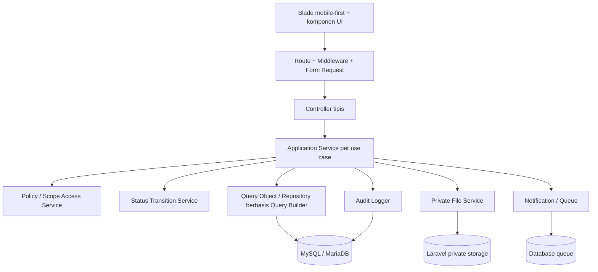

### 4.2 Batas lapisan

1. **Presentation** — Blade, komponen status/badge/timeline/checklist, tidak menentukan hak akses.
2. **HTTP** — route, middleware, Form Request, normalisasi input, respons.
3. **Application** — satu service per use case, misalnya `CreatePlacement`, `TransitionPlacementStatus`, `VerifyAttendance`, `PublishAssessment`.
4. **Authorization** — permission global, scope KSM/institusi, assignment pendidik, dan ownership peserta.
5. **Domain rules** — transition map, checklist, locking, duplicate candidate rules, overlap rules.
6. **Persistence** — Query Builder/query objects, transaksi, row locking, constraint database.
7. **Infrastructure** — private file storage, queue, mail, report export, QR/electronic approval.

### 4.3 Struktur kode yang disarankan mulai Fase 2

```text
app/
  Domain/
    Participants/
    Placements/
    Documents/
    Scheduling/
    Attendance/
    Logbooks/
    Assessments/
    Surveys/
    Completion/
  Application/
    <Domain>/<UseCase>Service.php
  Queries/
    <Domain>Query.php
  Policies/
  Services/
    AuditLogger.php
    FileUploadService.php
    ElectronicApprovalService.php
```

Tidak perlu memindahkan kode Fase 1 sekarang tanpa manfaat langsung. Struktur modular diterapkan pada modul baru, lalu refactor fondasi hanya jika ditemukan duplikasi nyata.

### 4.4 Pola transaksi dan concurrency

- Setiap perubahan multi-tabel berada dalam satu `DB::transaction()`.
- Transisi status membaca row menggunakan `lockForUpdate()` agar dua approver tidak memproses status yang sama bersamaan.
- Riwayat status dan audit ditulis dalam transaksi yang sama dengan perubahan utama.
- Constraint unik menjadi lapisan terakhir pencegahan duplikasi, misalnya presensi per penempatan/peserta/tanggal.
- Aksi publish/approve/close harus idempotent atau menolak status yang tidak lagi valid.

### 4.5 Strategi file privat

- Semua surat, dokumen peserta, logbook, formulir nilai, dan lampiran disimpan pada disk private.
- Nama storage random; nama asli hanya metadata yang telah disanitasi.
- `file_uploads` menyimpan disk, path, nama asli, MIME terdeteksi, ukuran, hash SHA-256, pengunggah, dan waktu.
- Download hanya melalui controller berotorisasi; jangan expose storage path.
- Service worker tidak boleh mengcache route download atau halaman terautentikasi.

---

## 5. ERD awal

ERD dibagi per domain agar relasi dapat dibaca. Nama tabel mengikuti struktur minimal master prompt.

### 5.1 Identitas, akses, dan master

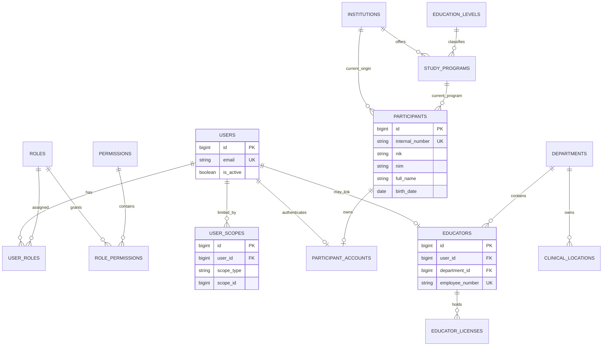

`USER_SCOPES.scope_id` menunjuk entitas sesuai `scope_type` (`department`, kemudian dapat diperluas ke `institution`, `placement`, atau `participant`). Karena tidak ada FK polymorphic, validasi dan pembersihan orphan menjadi tanggung jawab service.

### 5.2 Surat, peserta, penempatan, dokumen, dan penugasan

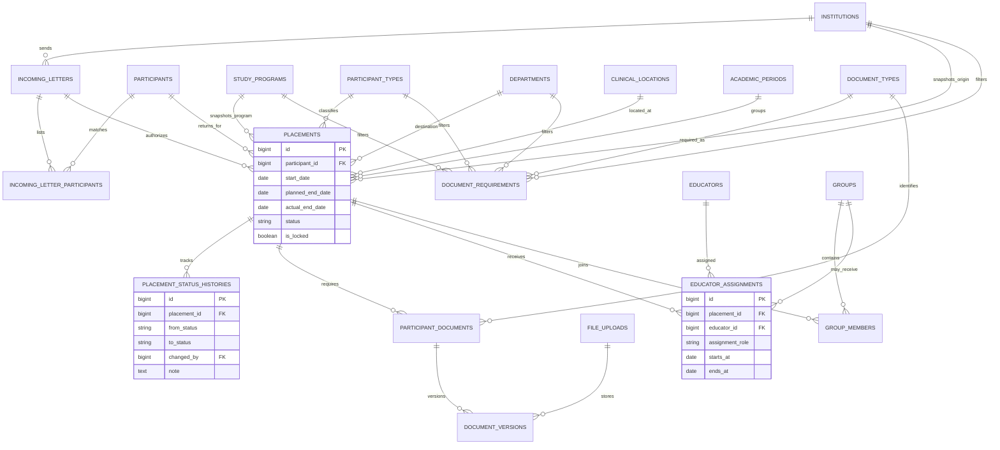

Data institusi, program, jenis peserta, KSM, dan lokasi tetap disimpan sebagai foreign key pada penempatan. Nama/kode penting yang harus tahan terhadap perubahan master dapat disalin sebagai snapshot terbatas bila kebutuhan legal laporan mengharuskannya.

### 5.3 Jadwal, presensi, dan logbook

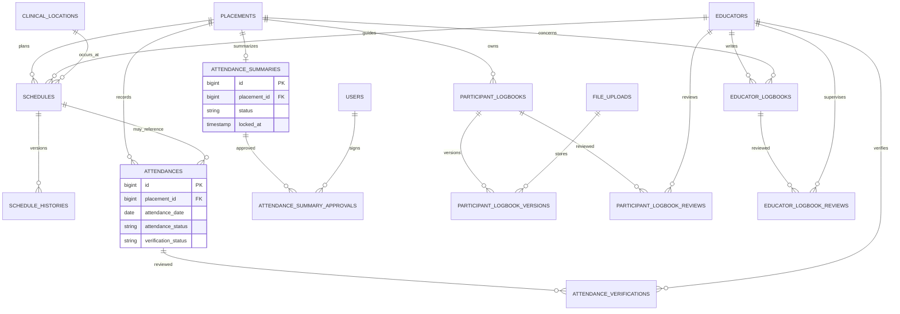

Constraint wajib: `UNIQUE(placement_id, attendance_date)` jika satu placement selalu mewakili satu peserta; jika struktur attendance menyimpan `participant_id` eksplisit, gunakan `UNIQUE(placement_id, participant_id, attendance_date)`.

### 5.4 Penilaian, survei, penyelesaian, dan infrastruktur

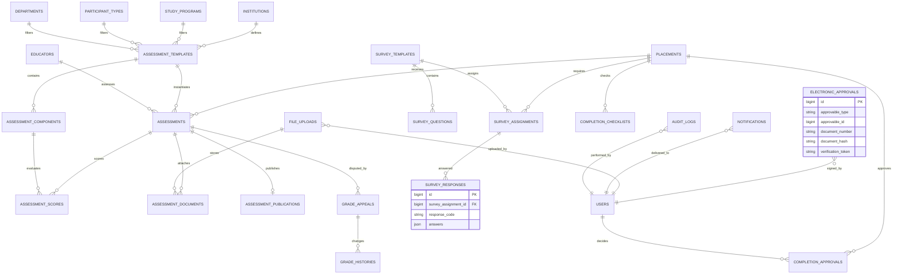

Respons survei pasien dilarang menyimpan nama lengkap, NIK, nomor rekam medis, diagnosis, atau data medis. `response_code` hanya menghubungkan bukti kewajiban dengan placement/peserta.

---

## 6. Matriks role dan permission

Legenda: **A** administrasi penuh sesuai prosedur; **M** membuat/mengubah; **P** menyetujui/mengesahkan; **V** melihat; **O** data milik sendiri/penugasan; **—** tidak memiliki akses. Semua akses KSM tetap dibatasi scope meskipun tabel menampilkan `M`, `P`, atau `V`.

| Kapabilitas | Super Admin | Admin Kordik | Tim Kordik | Sekretariat KSM | Ketua KSM | Pembimbing/Penguji | Supervisor | Peserta |
|---|---|---|---|---|---|---|---|---|
| Konfigurasi sistem | A | — | V | — | — | — | — | — |
| User, role, permission, scope | A | M tanpa eskalasi Super Admin | V | — | — | — | — | — |
| Audit log | V | V | V | — | — | — | — | — |
| Master institusi/program/jenjang | A | M | V | V | V | — | — | V terbatas |
| Master KSM/lokasi | A | M | V | V scope | V scope | V scope | V scope | V terkait |
| Master pendidik | A | M | V | V scope | M/P scope | O | O | V terkait |
| Surat masuk | V | M | V | V scope | V scope | — | — | O terbatas |
| Data induk peserta | V | M | V | V scope | V scope | O ditugaskan | — | O/M terbatas |
| Deteksi duplikat peserta | V | M/keputusan manual | V | — | — | — | — | — |
| Membuat penempatan | V | M | V | V scope | V scope | O ditugaskan | — | O |
| Jawaban ketersediaan KSM | V | V | V | M administratif | P | — | — | — |
| Persetujuan penerimaan | V | M pengajuan | P | V scope | V scope | — | — | O status |
| Dokumen persyaratan | V | M/verifikasi | V | M scope | V scope | O review | — | O upload |
| Pengecualian dokumen | V | M dengan alasan/persetujuan | P/V | V scope | P bila ditetapkan | — | — | O status |
| Penugasan pendidik | V | M administratif | V | M administratif scope | P scope | O | O | V terkait |
| Jadwal | V | M pengecualian | V | M administratif scope | V scope | P/O | — | M/O |
| Presensi harian | V | M koreksi beralasan | V | V scope | V scope | P/O verifikasi | — | M/O pengajuan |
| Rekap presensi akhir | V | M proses | V | V scope | P wajib | V terkait | — | O status |
| Logbook peserta | V | V | V | V scope | V scope | P/O review | — | M/O upload |
| Logbook pendidik | V | V | V | V scope | V scope | M/O | P/O review | — |
| Isi/tandatangani nilai | V, tidak mengubah langsung | V monitoring | V monitoring | V scope | V scope | M/P/O | — | O hasil terbit |
| Publikasi nilai | V | V monitoring | V monitoring | V scope | V scope | P/O langsung | — | O hasil terbit |
| Keberatan/perubahan nilai | V | M administratif beralasan | V | V scope | V scope | P/O tanggapan | — | M/O keberatan |
| Survei peserta | V status | V status | V status | V scope | V scope | — | — | M/O |
| Survei pasien | V status tanpa identitas | V status | V status | V scope | V scope | — | — | M/O bukti |
| Checklist penyelesaian | V | M pemeriksaan | V | V scope | V scope | V terkait | V terkait | O status |
| Persetujuan penyelesaian | V | M pengajuan/proses | P | V scope | V scope | — | — | O status |
| Laporan | V global | M global | V global | V scope | V scope | O ditugaskan | O ditugaskan | O terbatas |

### Aturan lintas role

- Multi-role bersifat union permission, tetapi scope tetap intersection dengan resource yang diakses.
- Super Admin tidak boleh mengubah nilai secara langsung; koreksi tetap melalui workflow beralasan dan teraudit.
- Admin adalah pelaksana perubahan administratif, bukan approver universal.
- Pembimbing/penguji/supervisor memperoleh akses peserta dari `educator_assignments`, bukan hanya role akun.
- Institusi Pendidikan merupakan role/portal masa depan dan belum masuk matriks runtime MVP.

---

## 7. Diagram status proses utama

### 7.1 Penempatan

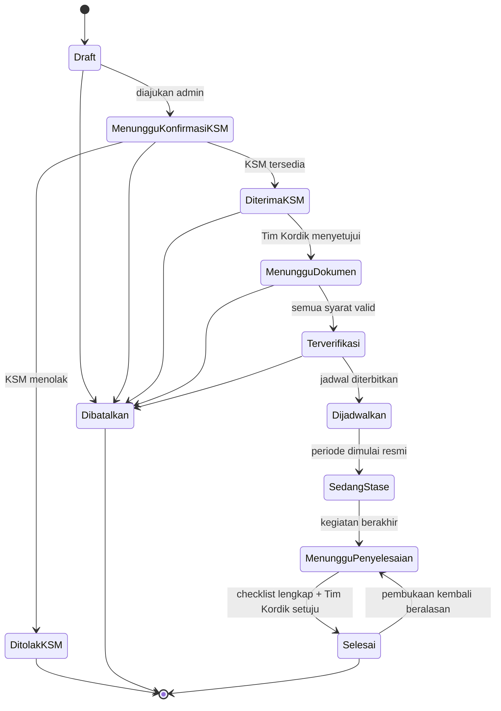

Gap aturan: master prompt tidak menyediakan status eksplisit “Menunggu persetujuan Tim Kordik” atau “Ditolak Tim Kordik” setelah KSM menyatakan tersedia. Keputusan status ini harus dikonfirmasi sebelum migration Fase 2.

### 7.2 Dokumen peserta

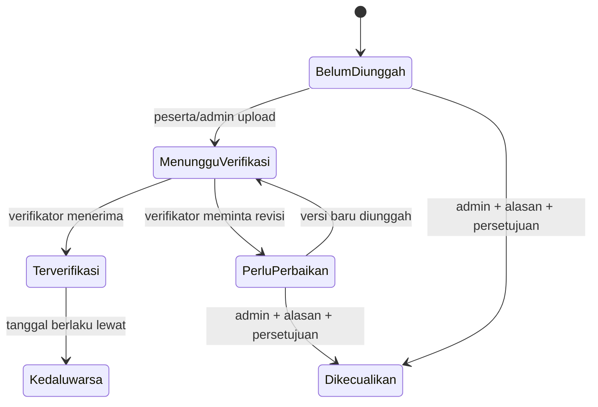

### 7.3 Jadwal

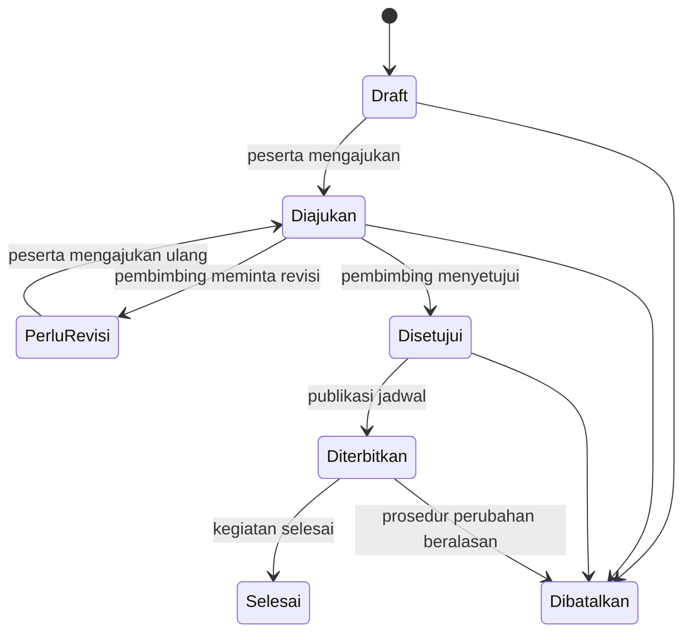

Jadwal diterbitkan tidak boleh diedit in-place. Perubahan membuat `schedule_histories` dan mempertahankan snapshot sebelum/sesudah.

### 7.4 Presensi dan rekap

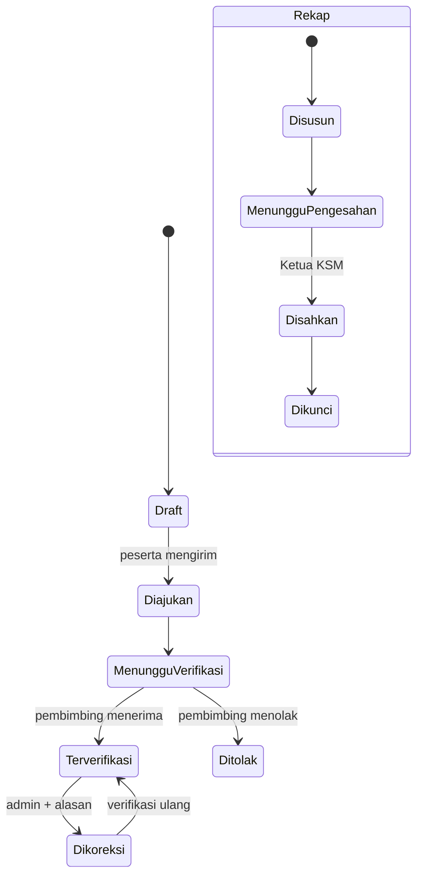

Belum diverifikasi bukan berarti tidak hadir. Status kehadiran dan status verifikasi harus disimpan pada kolom terpisah.

### 7.5 Logbook peserta

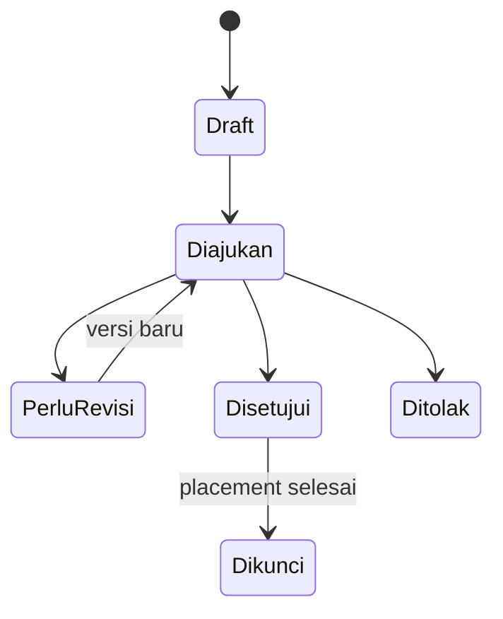

### 7.6 Penilaian dan keberatan

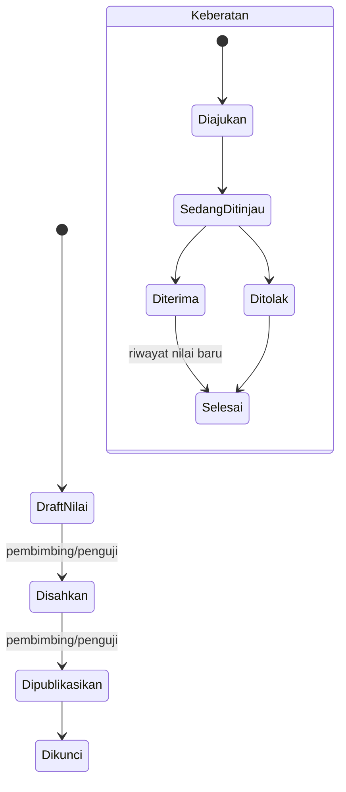

Nilai lama tidak ditimpa. Koreksi menambah `grade_histories`, electronic approval, alasan, nilai sebelum, dan nilai sesudah.

### 7.7 Penyelesaian

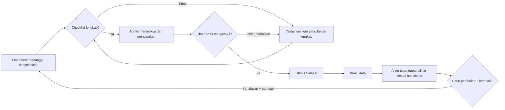

---

## 8. Rencana migration per fase

Migration dibuat bertahap. Jangan membuat seluruh tabel target sekaligus.

| Fase | Migration/tabel | Constraint dan indeks utama |
|---|---|---|
| 0 | Tidak ada tabel bisnis | Hanya audit dan perencanaan |
| 1 — aktual | `users`, reset/session/cache/jobs, `roles`, `permissions`, pivots, `user_scopes`, `institutions`, `education_levels`, `study_programs`, `departments`, `clinical_locations`, `participant_types`, `educators`, `educator_licenses`, `audit_logs` | Unique email/code, FK master, indeks aktif, indeks audit |
| 2A | `academic_periods`, `participants`, `participant_accounts` | Unique internal number; indeks NIK, email, NIM+institusi, nama+tanggal lahir; participant-account one-to-one |
| 2B | `incoming_letters`, `incoming_letter_participants`, `placements`, `placement_status_histories` | Unique nomor surat per institusi sesuai aturan; indeks periode/KSM/status; overlap diperiksa service + locking |
| 2C | `file_uploads`, `document_types`, `document_requirements`, `participant_documents`, `document_versions` | Unique requirement scope; version unique per document; hash dan private path; expiry index |
| 3 | `groups`, `group_members`, `educator_assignments`, `schedules`, `schedule_histories`, `notifications` | Assignment role/date index; jadwal placement+date; histori immutable |
| 4 | `attendances`, `attendance_verifications`, `attendance_summaries`, `attendance_summary_approvals` | Unique satu attendance per peserta-placement-tanggal; indeks status verifikasi; one summary per placement |
| 5 | `participant_logbooks`, `participant_logbook_versions`, `participant_logbook_reviews`, `educator_logbooks`, `educator_logbook_reviews` | Version unique; status/reviewer index; file FK; review history append-only |
| 6 | `assessment_templates`, `assessment_components`, `assessments`, `assessment_scores`, `assessment_documents`, `assessment_publications`, `grade_appeals`, `grade_histories` | Template version/effective period; unique score per component; publication one-to-one; histories append-only |
| 7A | `survey_templates`, `survey_questions`, `survey_assignments`, `survey_responses` | Unique kewajiban per template/placement; satu survei pasien minimum per placement; larangan kolom identitas pasien |
| 7B | `completion_checklists`, `completion_approvals`, `electronic_approvals` | Unique checklist item per placement; approval history; document hash/token unique; locked timestamps |
| 7C | Tambahan kolom/status arsip pada entitas relevan | Indeks `archived_at`, tanpa auto-delete |
| 8 | Indeks hasil profiling, tabel job/export bila benar-benar perlu | Composite index berdasarkan query report; jangan menebak sebelum `EXPLAIN` |

### Aturan migration

- Setelah migration pernah dipakai pada lingkungan bersama, koreksi dilakukan melalui migration baru, bukan mengedit file lama.
- Semua FK memakai aksi delete eksplisit (`restrict`, `null`, atau `cascade`) sesuai makna histori.
- Data transaksi pendidikan tidak memakai cascade delete dari participant/placement.
- Status disimpan sebagai string terkontrol oleh transition map; hindari MySQL `ENUM` agar perubahan status tetap portabel.
- Nilai uang/tanggal/skor memakai tipe presisi yang sesuai; jangan gunakan float untuk perhitungan nilai berbobot.

---

## 9. Risiko keamanan dan privasi

| Risiko | Level | Mitigasi |
|---|---|---|
| Source code tidak terlacak Git | **Kritis** | Buat repository mandiri/baseline commit sebelum perubahan berikutnya |
| PHP default 7.4 dipakai tanpa sengaja | Tinggi | Perbaiki PATH atau sediakan script/runtime command baku |
| MySQL lokal `root` tanpa password | Tinggi untuk mesin bersama | Hanya local; production memakai user khusus dengan least privilege dan secret manager |
| Scope KSM tidak diterapkan konsisten pada route baru | Tinggi | Wajib policy/scope middleware + negative test untuk setiap resource |
| IDOR pada download/detail resource | Tinggi | Resolve resource lalu cek permission, scope, assignment, dan ownership di backend |
| Dokumen pendidikan tersimpan publik | Tinggi | Private disk, authorized controller, random path, hash, MIME sniffing |
| Data pasien masuk ke survei/logbook | **Kritis** | Larang field identitas; validasi, panduan UI, review file, dan audit insiden |
| NIK/data kontak peserta terekspos | Tinggi | Least privilege, masking UI, logging minimal, pertimbangkan encryption at rest untuk identifier sensitif |
| Audit log dapat diubah oleh akun DB aplikasi | Tinggi | DB grants append/select, tidak ada update/delete, backup/WORM bila kebijakan memungkinkan |
| Audit menyimpan payload sensitif tak dikenal | Sedang-Tinggi | Allowlist field audit per use case, bukan hanya denylist global |
| Race condition status/presensi | Tinggi | Transaction, `lockForUpdate`, unique constraint, idempotency |
| Session dicuri atau tertinggal | Tinggi production | HTTPS, secure/httpOnly/SameSite cookie, session rotation, timeout, invalidasi saat nonaktif |
| `SESSION_ENCRYPT=false` | Sedang | Evaluasi aktifkan pada production; minimal lindungi DB session dan batasi isinya |
| Reset password melalui mail tidak terkonfigurasi | Sedang | SMTP/provider aman, token expiry, rate limit, test delivery |
| PWA mengcache data sensitif | Tinggi | Pertahankan network-only untuk navigation/download; hanya cache aset versioned |
| Formula nilai salah antar institusi | Tinggi | Template versioning, decimal precision, golden test per institusi |
| Nilai diubah setelah publish | Tinggi | Lock record; hanya workflow appeal/correction dengan history dan approval |
| Backup/restore belum ada | Tinggi | Backup terenkripsi, retensi, offsite copy, restore drill berkala |
| Dependency supply-chain | Sedang | Commit lock files, audit CI, update terjadwal, minimalkan package |
| Debug aktif di production | Tinggi | `APP_DEBUG=false`, environment validation saat deploy |

### Prinsip privacy-by-design

- Simpan data minimum yang diperlukan.
- Jangan menyalin isi file sensitif ke log atau audit.
- Mask NIK/nomor lisensi pada list; tampilkan lengkap hanya kepada role yang benar-benar perlu.
- Pisahkan status kewajiban survei pasien dari identitas narasumber.
- Retensi aktif minimal tiga tahun bukan instruksi auto-delete; arsip dan penghapusan memerlukan kebijakan resmi.

---

## 10. Asumsi dan pertanyaan yang menghambat fase terkait

Tidak ada pertanyaan yang menghambat penyelesaian dokumentasi Fase 0. Hal berikut wajib diputuskan sebelum fase yang disebutkan.

### Sebelum Fase 2

1. **Nomor identitas internal peserta:** format, penerbit, dan apakah harus berurutan per tahun.
2. **Benturan placement:** apakah larangan overlap berlaku untuk semua placement, hanya hari pendidikan, atau hanya pada KSM yang sama.
3. **Status persetujuan Tim Kordik:** perlu status `menunggu_persetujuan_kordik`/`ditolak_kordik` atau keputusan direkam sebagai approval terpisah tanpa status baru.
4. **Deteksi duplikat:** normalisasi NIK/NIM/email/nama, cara menangani field kosong, dan apakah kandidat memiliki skor kemiripan atau hanya exact match per aturan.
5. **Surat:** keunikan nomor surat berlaku global atau per institusi/tahun.
6. **File:** daftar MIME, ukuran maksimum, dan siapa yang boleh melihat setiap jenis dokumen.
7. **Data master resmi:** daftar institusi, program, jenjang, KSM, lokasi, dan periode akademik yang disahkan rumah sakit.

### Sebelum Fase 3–5

8. Definisi kelompok lintas placement dan apakah satu peserta dapat berpindah kelompok.
9. Pihak yang menyetujui penggantian pendidik dan perpanjangan placement.
10. Kalender hari pendidikan, hari libur, batas waktu pengajuan presensi, dan aturan verifikator pengganti.
11. Ukuran/format logbook dan proses pemeriksaan potensi data pasien di dalam file.

### Sebelum Fase 6–8

12. Contoh formulir nilai resmi tiap institusi, aturan pembulatan, bobot, dan batas lulus.
13. Jangka waktu keberatan nilai dan authority koreksi setelah publikasi.
14. Bentuk bukti survei pasien MVP yang dapat diverifikasi tanpa identitas pasien.
15. Penomoran dokumen, masa berlaku verification token/QR, dan informasi yang boleh tampil pada halaman verifikasi publik.
16. RPO/RTO backup, retensi arsip, serta pejabat yang berwenang membuka kembali placement selesai.

---

## 11. Rencana pengujian

### 11.1 Strategi

- **Feature test** untuk route, validasi, authorization, workflow, file access, dan response UI.
- **Unit test** untuk transition map, kalkulasi nilai, duplicate matching, checklist, hash, dan helper murni.
- **MySQL integration test** untuk constraint, JSON, locking, unique index, dan concurrency; SQLite tetap dipakai untuk feedback cepat.
- **Browser test/UAT** untuk alur mobile, aksesibilitas dasar, PWA, dan workflow role nyata.
- Setiap test memiliki kondisi berhasil, input salah, akses ilegal, duplikasi, stale state, dan data terkunci.

### 11.2 Matriks test per fase

| Fase | Test prioritas |
|---|---|
| 1 | Login/logout, rate limit, reset password, akun nonaktif, multi-role, larangan eskalasi Super Admin, scope KSM, audit sanitization, master uniqueness, PWA cache |
| 2 | Duplicate candidate exact/partial, tidak auto-merge, peserta lama kembali, letter multi-participant, placement overlap, status transition ilegal, dokumen wajib dinamis, private file/IDOR |
| 3 | Multi-educator assignment, pergantian beralasan, group membership, jadwal di luar periode, approval/revision, perubahan jadwal published, extension |
| 4 | Satu presensi per hari, belum verified bukan absent, substitute verifier, koreksi, summary count, Ketua KSM wajib approve, lock after approval |
| 5 | Version logbook tidak hilang, MIME/size, review pembimbing, educator logbook, supervisor scope, electronic approval, lock |
| 6 | Template version, decimal score, upload-only assessment, assigned educator access, direct publication, participant sees published only, appeal/history, immutable old grade |
| 7 | Satu survey peserta per placement, minimum satu survey pasien, tidak ada PII pasien, completion checklist incomplete rejection, Tim Kordik approval, lock/reopen audit |
| 8 | Report scope leakage, filter/date timezone, Excel/PDF content, QR verification, query performance, backup/restore, security regression |

### 11.3 Non-functional test

- Authorization matrix test per role dan scope.
- IDOR test dengan ID valid dari KSM/institusi lain.
- CSRF, session fixation, rate limit, password reset enumeration.
- Upload polyglot/renamed executable, oversized file, invalid MIME, path traversal.
- Concurrent approval dan concurrent attendance insert.
- Query count dan `EXPLAIN` untuk dashboard/report berdata besar.
- Mobile widths 320/390/768/desktop dan keyboard navigation.
- PWA logout/offline memastikan halaman sensitif tidak tersedia dari cache.
- Restore drill database dan file; verifikasi hash dokumen setelah restore.

### 11.4 Status test saat audit

- PHPUnit: **15 test, 49 assertion, lulus**.
- Pint: **lulus**.
- Migration MySQL: **lulus**.
- Composer locked advisory audit: **tidak ada advisory**.
- npm production audit: **0 vulnerability**.

Gap test Fase 1: reset password delivery/token expiry, throttle setelah lima kegagalan, invalidasi session akun nonaktif yang sedang login, route-level department scope, educator license CRUD, audit append-only, dan installability PWA lintas browser.

---

## 12. Urutan pengerjaan Fase 1

Urutan yang seharusnya digunakan dan status retrospektif:

| Urutan | Pekerjaan | Status audit |
|---:|---|---|
| 0 | Pastikan repository Git, runtime PHP, `.env.example`, dan baseline test | **Belum lengkap: Git/PATH** |
| 1 | Bootstrap Laravel, MySQL, timezone/locale/session | Selesai |
| 2 | Migration user/session dan autentikasi login/logout | Selesai |
| 3 | Reset password, rate limit, akun aktif/nonaktif | Selesai secara kode; E2E mail belum |
| 4 | Role, permission, multi-role, seed matrix | Selesai |
| 5 | Scope KSM dan service authorization | Selesai struktural; enforcement resource menunggu modul bisnis |
| 6 | Manajemen pengguna dan assignment akses | Selesai; akun awal belum dibuat |
| 7 | Audit log dan alasan perubahan | Selesai application-level |
| 8 | Master institusi, jenjang, program, KSM, lokasi, jenis peserta | Selesai |
| 9 | Master pendidik dan lisensi | Pendidik selesai; UI lisensi belum |
| 10 | Layout dashboard mobile-first | Selesai |
| 11 | PWA dasar tanpa cache sensitif | Selesai |
| 12 | Feature/unit test, formatter, MySQL migration, browser QA | Selesai untuk cakupan yang ada; gap tercatat |

---

## 13. Gate sebelum Fase 2

### Wajib ditutup

1. Jadikan SIKORDIK repository Git mandiri atau masukkan secara eksplisit ke repository yang benar, lalu buat baseline commit.
2. Buat akun Super Admin awal melalui secret environment, jalankan seeder, kemudian hapus secret bootstrap dari environment.
3. Putuskan status persetujuan/penolakan Tim Kordik setelah respons KSM.
4. Putuskan aturan overlap placement dan format identitas internal peserta.
5. Tetapkan kebijakan file minimum: MIME, ukuran, hak akses, dan private storage.

### Sangat dianjurkan ditutup sebagai koreksi Fase 1

1. Tambah CRUD lisensi pendidik atau nyatakan secara eksplisit ditunda.
2. Tambah test rate limit, reset password, session invalidation, dan MySQL integration.
3. Siapkan environment production template untuk HTTPS, secure cookie, mail, queue worker, log, dan backup.
4. Tetapkan strategi append-only audit log pada user database production.
5. Perbaiki PATH PHP lokal dan perbarui Composer.

### Rekomendasi keputusan

Setelah laporan ini disetujui, kerjakan satu **checkpoint koreksi Fase 1** untuk menutup blocker teknis yang berada dalam scope proyek. Setelah test kembali hijau dan keputusan bisnis Fase 2 terdokumentasi, barulah mulai migration surat, peserta, placement, dan dokumen.

---

## 14. Kesimpulan Fase 0

- Fondasi teknis layak dilanjutkan setelah perbaikan tata kelola source dan keputusan bisnis Fase 2.
- Skema Fase 1 ter-normalisasi cukup baik, memakai FK/indeks yang memadai, serta mengikuti Query Builder.
- RBAC dan audit sudah memiliki pola yang dapat diperluas, tetapi enforcement scope harus menjadi syarat setiap route bisnis baru.
- Risiko privasi terbesar berada pada file dan data pasien; desain private storage dan larangan PII harus hadir sejak migration Fase 2, bukan ditambahkan belakangan.
- Fase 2 belum boleh dimulai sampai gate wajib pada bagian 13 disetujui dan ditutup.
