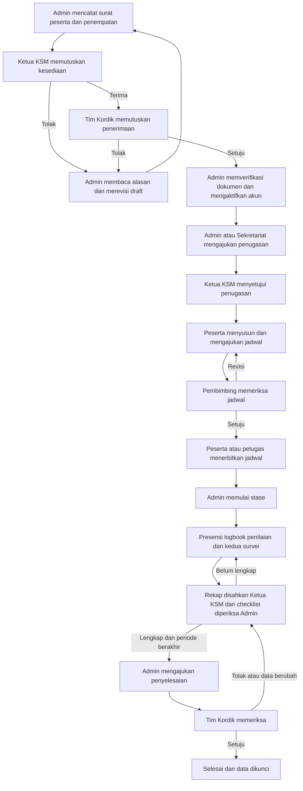

# Buku Panduan Penggunaan SIKORDIK

Sistem Informasi Manajemen Pendidikan Klinis RSBM

Edisi 1 | 15 September 2026 | Cakupan fitur sampai Fase 8

Panduan ini membantu Admin Kordik, Tim Kordik, petugas KSM, pendidik, dan peserta menjalankan pendidikan klinis dari penerimaan hingga penyelesaian. Mulailah dari petunjuk sesuai peran, lalu ikuti bab kegiatan yang sedang dikerjakan.

Urutan utama adalah penerimaan, persetujuan, verifikasi dokumen, penugasan, penerbitan jadwal, pelaksanaan kegiatan, dan penyelesaian. Menyimpan data sebagai draft belum mengirimkannya kepada pemeriksa. Selalu periksa status setelah menekan tombol tindakan.

## Cara menggunakan buku ini

- Pengguna baru: baca halaman 2 sampai 5 untuk memahami titik mulai, istilah, akses, dan alur bersama.
- Admin dan petugas KSM: gunakan halaman 6 sampai 11 untuk persiapan, penerimaan dan penjadwalan.
- Peserta dan pendidik: gunakan halaman 11 sampai 16 untuk jadwal, kegiatan harian, logbook, nilai, dan survei.
- Menutup stase atau mencari kendala: gunakan halaman 17 sampai 21.

Panduan ini dapat dipakai untuk orientasi dan latihan. Penggunaan operasional dengan data nyata mengikuti pemberitahuan kesiapan dan izin operasional dari pengelola RSBM. Gunakan alamat aplikasi dan akun yang diberikan pengelola.

## Daftar isi ringkas

- Halaman 2-5: titik mulai setiap peran, diagram proses bisnis, status dan cara masuk.
- Halaman 6-8: persiapan pengelola, surat, peserta, impor dan penempatan.
- Halaman 9-11: persetujuan penerimaan, dokumen, penugasan, kelompok dan jadwal.
- Halaman 12-14: presensi, rekap, logbook dan penilaian.
- Halaman 15-16: keberatan nilai, perubahan stase dan kedua survei.
- Halaman 17-18: checklist akhir, penyelesaian, pembukaan kembali dan arsip.
- Halaman 19-21: laporan, verifikasi pengesahan, kendala dan latihan lengkap.

Gunakan panel bookmark pada pembaca PDF untuk langsung menuju bab yang dibutuhkan.

<!-- page -->
# 1 Mulai dari peran Anda

Jangan mulai dari urutan menu di layar. Mulailah dari tanggung jawab Anda dan status penempatan peserta.

| Peran | Langkah pertama | Pekerjaan berikutnya |
|---|---|---|
| Super Admin | Siapkan master KSM dan akun petugas | Atur hak akses dan cakupan KSM; pantau sistem |
| Admin Kordik | Cari peserta lama dan catat surat masuk | Buat penempatan, ajukan, periksa dokumen, siapkan penugasan, pantau dan ajukan penyelesaian |
| Sekretariat KSM | Periksa penempatan KSM Anda | Bantu penugasan, kelompok, jadwal, dan pembuatan rekap |
| Ketua atau Koordinator KSM | Periksa antrean penerimaan KSM | Putuskan penugasan dan perpanjangan; sahkan rekap presensi |
| Tim Kordik | Periksa penerimaan yang telah diterima KSM | Putuskan penerimaan, pengecualian, perpanjangan dan penyelesaian |
| Peserta | Pastikan akun aktif dan penempatan benar | Susun jadwal setelah penugasan siap; isi presensi, logbook dan survei; lihat nilai |
| Pembimbing | Pastikan penugasan resmi sudah disetujui | Periksa jadwal, presensi dan logbook peserta; isi, sahkan dan publikasikan nilai |
| Penguji | Periksa penugasan sebagai penguji | Isi penilaian; pembimbing yang ditunjuk mengesahkan dan memublikasikan |
| Supervisor | Periksa penugasan sebagai supervisor | Periksa logbook kegiatan pembimbing yang menunjuk Anda |

Satu akun dapat mempunyai beberapa role. Hak bertindak tetap mengikuti cakupan KSM, kepemilikan, dan penugasan resmi. Pemohon tidak boleh menyetujui sendiri permohonan yang mensyaratkan pemisahan petugas. Super Admin tidak otomatis menjadi pemberi keputusan bisnis.

Hasil orientasi: Anda mengetahui menu pertama yang dibuka, data yang menjadi tanggung jawab Anda, dan petugas yang menerima pekerjaan berikutnya.

<!-- page -->
# 2 Peta proses bisnis dari awal sampai akhir

Proses berikut berlaku untuk satu penempatan. Peserta yang kembali mengikuti stase menggunakan data induk lama dan penempatan baru.

Pada penerimaan, penolakan KSM atau Tim Kordik harus dibaca alasannya. Admin memperbaiki melalui revisi kembali ke draft dan mengulangi pengajuan. Pada kegiatan harian, permintaan revisi dikembalikan kepada penulis untuk diperbaiki dan diajukan ulang.

Penyelesaian hanya dapat diajukan setelah hari terakhir stase berakhir dan seluruh kewajiban lengkap. Berakhirnya tanggal stase tidak membuat status otomatis menjadi selesai.

<!-- page -->
# 3 Memahami data dan status

Peserta adalah data induk orang. Nomor peserta tetap dipakai saat orang yang sama datang kembali. Penempatan adalah satu episode pendidikan di KSM dengan institusi, program, jenis peserta, dan periode tertentu. Jadwal adalah kegiatan pada penempatan; satu penempatan mempunyai banyak jadwal.

| Status penempatan | Artinya | Penanggung jawab berikutnya |
|---|---|---|
| draft | Data disiapkan; periode belum dipesan | Admin mengajukan ke KSM |
| menunggu_konfirmasi_ksm | Menunggu kesediaan KSM | Ketua atau Koordinator KSM |
| diterima_ksm | KSM menerima; sistem meneruskan antrean | Tim Kordik melalui antrean berikutnya |
| menunggu_persetujuan_kordik | Menunggu keputusan penerimaan | Tim Kordik |
| menunggu_dokumen | Penerimaan disetujui, checklist belum selesai | Admin Kordik |
| terverifikasi | Checklist administrasi lengkap | Admin, KSM, peserta dan pembimbing menyiapkan jadwal |
| dijadwalkan | Jadwal telah diterbitkan | Admin memulai stase sesuai periode |
| sedang_stase | Kegiatan dan administrasi harian berjalan | Peserta, pendidik dan petugas |
| menunggu_penyelesaian | Menunggu pemeriksaan akhir atau tindak lanjut | Admin dan Tim Kordik |
| selesai | Penyelesaian disahkan dan data dikunci | Baca atau unduh sesuai hak akses |
| ditolak_ksm atau ditolak_kordik | Penerimaan ditolak dengan alasan | Admin meninjau dan merevisi bila akan diajukan ulang |
| dibatalkan | Penempatan dibatalkan; histori tetap ada | Admin menindaklanjuti sesuai alasan |

Status penempatan berbeda dari status dokumen, jadwal, presensi, logbook, nilai dan survei. Contoh: jadwal disetujui masih harus diterbitkan; nilai disahkan masih harus dipublikasikan. Arsip adalah penanda penyimpanan riwayat, bukan penghapusan.

<!-- page -->
# 4 Masuk aplikasi dan mengenali menu

## Masuk dan keluar

1. Buka alamat SIKORDIK yang diberikan pengelola melalui peramban.
2. Masukkan Email dan Kata sandi, lalu tekan Masuk. Hindari Ingat saya pada perangkat bersama.
3. Periksa Dashboard dan Notifikasi. Pastikan data sesuai peran dan KSM Anda.
4. Jika lupa kata sandi, pilih Lupa kata sandi?, masukkan email akun, lalu ikuti tautan pemulihan yang diterima. Jika tidak diterima, periksa folder spam dan hubungi pengelola akun.
5. Setelah selesai, gunakan Keluar. Jangan menyerahkan sesi yang masih aktif kepada pengguna lain.

Peserta memperoleh akses setelah Admin memverifikasi penempatan dan kepemilikan akun. Email kontak pada data peserta tidak otomatis menjadi akun login. Tidak ada pendaftaran mandiri peserta melalui halaman login.

## Menu yang digunakan sehari hari

- Dashboard: ringkasan pekerjaan sesuai peran. Angka peserta aktif menghitung penempatan sedang stase; orang yang mempunyai penempatan paralel dapat dihitung lebih dari sekali.
- Notifikasi: pemberitahuan internal untuk pengajuan dan keputusan. Buka data terkait lalu tindak lanjuti; menandai notifikasi dibaca tidak menyetujui pengajuan.
- Penerimaan & penempatan: data peserta, surat, impor, persyaratan dan penerimaan.
- Penugasan & jadwal: pendidik, kelompok, jadwal dan perpanjangan.
- Presensi, Logbook, Penilaian: pencatatan dan pemeriksaan kegiatan pendidikan.
- Survei & penyelesaian: kewajiban survei dan checklist akhir.
- Laporan Excel / PDF dan Verifikasi pengesahan: pelaporan dan pengecekan pengesahan.
- Pengguna, Role, master data dan Audit log: tersedia menurut hak administrasi akun.

Jika daftar kosong, periksa filter, status, dan penempatan yang dipilih. Jika tindakan tidak tersedia, periksa peran, cakupan KSM, penugasan, serta status data melalui Admin. Jam kegiatan menggunakan WITA.

<!-- page -->
# 5 Persiapan oleh pengelola dan Admin

Selesaikan persiapan sebelum memasukkan satu angkatan peserta. Gunakan data resmi yang telah disetujui pengelola pendidikan.

## Urutan pengisian awal

1. Isi master Institusi Pendidikan, Jenjang Pendidikan, KSM dan Jenis Peserta. Pastikan kode tidak ganda dan status aktif.
2. Isi Program Studi dengan institusi serta jenjang yang sesuai. Isi Lokasi Klinis dan kaitkan lokasi kegiatan dengan KSM yang benar.
3. Melalui Pengguna, tambahkan akun petugas. Isi identitas, email, jabatan, kata sandi beserta konfirmasi, role, dan Scope KSM. Kata sandi akun baru minimal 12 karakter. Simpan pengguna.
4. Isi master Pembimbing / Penguji / Supervisor. Tautkan akun yang benar, tentukan KSM dan kemampuan sebagai pembimbing, penguji atau supervisor. Akun dan master pendidik harus aktif.
5. Admin mencatat lisensi atau otorisasi pendidikan melalui bagian lisensi pada Penugasan & jadwal. Gunakan bukti resmi dan periode berlaku yang mencakup penugasan.
6. Siapkan Persyaratan dokumen dalam Penerimaan & penempatan, Template penilaian dalam Penilaian, dan Kelola tautan survei dalam Survei & penyelesaian.

## Mengelola perubahan

Gunakan Ubah untuk memperbaiki master atau akun, dan isi alasan ketika diminta. Saat menonaktifkan akun, sesi aktif pengguna akan dihapus. Periksa dampaknya terhadap pemeriksa yang masih mempunyai pekerjaan tertunda.

Pengelola Role mengatur permission sesuai kewenangan yang telah ditetapkan. Hindari memberi banyak role hanya agar tombol muncul; perbaiki cakupan dan penugasan yang menjadi dasar pekerjaan.

## Pemeriksaan sebelum angkatan dimulai

- Petugas KSM dapat melihat KSM yang menjadi tanggung jawabnya.
- Pendidik mempunyai akun, kemampuan peran dan lisensi yang berlaku.
- Lokasi, persyaratan, template penilaian dan kedua tautan survei sudah siap.
- Pengelola telah menyatakan lingkungan aplikasi siap digunakan. Panduan ini bukan persetujuan operasional.

<!-- page -->
# 6 Mencatat surat dan peserta

Pelaksana utama adalah Admin Kordik. Siapkan surat pengantar, data institusi, dan identitas peserta sebelum mulai.

## Surat masuk

1. Buka Penerimaan & penempatan, lalu Surat masuk.
2. Isi institusi pengirim, nomor surat, tanggal dan informasi yang diminta formulir. Simpan surat.
3. Unggah surat dalam PDF maksimal 10 MB melalui bagian berkas surat. Periksa hasil pemeriksaan keamanan.
4. Gunakan surat yang sama untuk peserta atau penempatan yang memang berasal dari surat tersebut. Perbaikan berkas dibuat sebagai versi baru.

Nomor surat yang sama pada institusi dan tahun surat yang sama dianggap duplikat. Jangan membuat surat baru untuk setiap peserta dalam satu surat rombongan.

## Data induk peserta

1. Buka Data peserta untuk melihat Data induk peserta. Cari nama, nomor peserta, atau NIM terlebih dahulu.
2. Bila orang yang sama sudah terdaftar, gunakan Tambah penempatan. Gunakan Ubah data / foto jika profil perlu diperbaiki.
3. Bila belum terdaftar, buka Daftarkan peserta baru. Isi nama sesuai identitas dan institusi; lengkapi tanggal lahir, NIM, email kontak dan NIK bila tersedia. NIK opsional harus 16 digit.
4. Tekan Periksa kandidat duplikat. Tinjau alasan kecocokan berdasarkan NIK, NIM dan institusi, email, atau nama dan tanggal lahir.
5. Gunakan peserta lama jika sama. Jika kandidat berbeda orang, ikuti konfirmasi dan isi alasan yang diminta. Jangan menggandakan NIK.
6. Setelah tersimpan, catat nomor peserta. Foto dapat diperbarui melalui Ubah data / foto; JPEG, PNG atau WebP maksimal 3 MB.

Hasil: tersedia surat dan satu data induk per orang. Contoh nomor peserta adalah PDK-2026-000001; nomor ini hanya ilustrasi.

<!-- page -->
# 7 Impor peserta dan membuat penempatan

## Impor peserta dalam jumlah banyak

1. Siapkan XLSX tanpa macro dengan satu worksheet, maksimal 5 MB dan 500 peserta. Format semua kolom sebagai teks agar nol awal NIM dan NIK tidak hilang.
2. Baris pertama kolom A sampai E harus berurutan: name, birth_date, nik, nim, email. Tanggal memakai YYYY-MM-DD. Hindari formula dan tautan eksternal.
3. Buka Penerimaan & penempatan, lalu Impor XLSX untuk membuka Impor peserta. Pilih institusi dan Sumber XLSX, lalu Unggah dan pratinjau.
4. Tinjau hasil setiap baris dan kandidat peserta lama. Pilih peserta lama secara eksplisit; sistem tidak menggabungkan identitas otomatis.
5. Perbaiki baris yang gagal dan konfirmasikan baris sesuai pilihan yang tersedia pada pratinjau. Periksa hasil penyimpanan; jangan menganggap semua baris berhasil hanya karena unggahan selesai.

Impor mengelola data peserta. Lanjutkan pembuatan penempatan untuk episode pendidikan masing-masing peserta.

## Membuat penempatan

1. Pilih Tambah penempatan untuk peserta yang benar.
2. Pilih surat, institusi, program studi, jenis peserta, KSM dan tanggal mulai serta selesai sesuai formulir.
3. Simpan, kemudian baca kembali identitas dan periode pada Detail penempatan. Status awal adalah draft.
4. Periksa peringatan periode bertumpang tindih. Tanggal akhir dan awal sama-sama termasuk periode: 1-10 September berbenturan dengan 10-20 September untuk peserta yang sama.
5. Jika benar, pada Tindak lanjut pilih Ajukan ke KSM lalu Simpan keputusan.

Benturan dalam KSM yang sama diselesaikan melalui penempatan lama. Program paralel lintas KSM memerlukan permohonan pengecualian beralasan, dokumen pendukung bersih, dan persetujuan Tim Kordik sebelum pengajuan. Persetujuan paralel tidak mengizinkan benturan jam kegiatan.

Hasil: status menunggu_konfirmasi_ksm. Serahkan tindak lanjut kepada Ketua atau Koordinator KSM terkait.

<!-- page -->
# 8 Persetujuan penerimaan dan dokumen

## Keputusan KSM dan Tim Kordik

1. Ketua atau Koordinator KSM membuka Detail penempatan dalam cakupannya dan memeriksa peserta, program, periode serta kesediaan KSM.
2. Pada Tindak lanjut, pilih KSM tersedia / terima atau KSM menolak, isi alasan yang diperlukan lalu Simpan keputusan.
3. Penerimaan KSM diteruskan menjadi menunggu_persetujuan_kordik. Tim Kordik memeriksa, lalu memilih Setujui penerimaan atau Tolak penerimaan.
4. Setelah disetujui Tim Kordik, status menjadi menunggu_dokumen. Jika ditolak, Admin membaca alasan dan menggunakan Revisi kembali ke draft bila akan mengajukan ulang.

## Verifikasi administrasi oleh Admin Kordik

1. Pada Detail penempatan, lihat Checklist dokumen. Kewajiban mengikuti template untuk penempatan tersebut.
2. Buka Unggah dokumen penempatan, pilih kategori yang sesuai dan unggah berkas. Peserta menyerahkan dokumen kepada Admin melalui saluran resmi yang ditentukan pengelola.
3. Tunggu status berkas clean. Unggah berhasil belum berarti dokumen dinyatakan valid.
4. Pada setiap persyaratan, buka Review / pengecualian. Pilih Valid atau Tolak dokumen, pilih versi berkas yang sesuai, isi masa berlaku bila ada dan hasil pemeriksaan, lalu Simpan review.
5. Pengecualian persyaratan hanya diputuskan Tim Kordik dengan alasan. Admin tidak menandai dokumen yang belum memenuhi syarat sebagai valid.
6. Setelah seluruh kewajiban lengkap, pilih Verifikasi checklist lengkap dan Simpan keputusan. Status menjadi terverifikasi.
7. Pada Data induk peserta, buka Aktivasi akun. Isi email akun, bukti pemeriksaan kepemilikan dan konfirmasi, lalu Aktifkan setelah verifikasi. Untuk akun baru, peserta menggunakan Lupa kata sandi? untuk menetapkan kata sandi melalui email yang telah diperiksa; jika email pemulihan belum tersedia, hubungi pengelola akun.

Contoh checklist awal: Koas memerlukan surat, ijazah dan BHD; Residen ditambah SIP, STR dan sertifikat kompetensi; Nonkedokteran memerlukan surat dan ijazah. Checklist yang tampil pada penempatan menjadi acuan pengguna.

<!-- page -->
# 9 Penugasan pendidik dan kelompok

Pelaksana penyiapan adalah Admin Kordik atau Sekretariat KSM sesuai cakupan. Keputusan penugasan diberikan Ketua atau Koordinator KSM yang berwenang dan berbeda dari pemohon.

## Menetapkan pembimbing penguji dan supervisor

1. Buka Penugasan & jadwal, pilih penempatan yang telah terverifikasi.
2. Pada Penugasan pendidik, pilih Pendidik dan Peran penugasan: Pembimbing, Penguji atau Supervisor.
3. Isi tanggal mulai dan selesai. Pastikan periode mencakup kegiatan yang akan dibimbing, diperiksa atau dinilai.
4. Pilih kelompok bila diperlukan. Untuk tambahan pendidik, gunakan Penugasan tambahan; untuk pergantian, pilih penugasan asal yang digantikan.
5. Isi alasan, kemudian tekan Ajukan penugasan ke KSM.
6. Ketua KSM membuka penugasan Menunggu KSM, memilih Setujui atau Tolak, mengisi alasan lalu Konfirmasi.

Hasil: penugasan Disetujui dapat dipilih pada formulir kegiatan terkait. Bila pendidik tidak tersedia, periksa KSM, kemampuan peran, akun aktif, tautan akun dan lisensinya. Minimal satu kredensial aktif diperlukan; kredensial aktif harus berlaku untuk periode penugasan.

## Menggunakan kelompok

Buat kelompok pada Penugasan & jadwal sesuai KSM, kemudian pada detail penempatan buka Kelompok dan histori keanggotaan. Pilih kelompok dan periode keanggotaan yang berada dalam periode penempatan.

Perpindahan dilakukan dengan mengakhiri keanggotaan lama disertai alasan, lalu menambahkan keanggotaan baru tanpa tumpang tindih. Jadwal dan penugasan tetap dicatat per penempatan; menambah anggota tidak otomatis menyalin jadwal atau penugasan seluruh kelompok.

Pergantian pendidik tidak memindahkan jadwal lama otomatis. Jadwal aktif yang masih merujuk pendidik lama perlu ditindaklanjuti melalui perubahan atau pembatalan yang disetujui. Hubungi Admin jika pergantian tertahan oleh kegiatan aktif.

<!-- page -->
# 10 Menyusun dan menerbitkan jadwal

Peserta menyusun jadwal setelah penugasan pembimbing disetujui. Admin atau Sekretariat KSM dapat membantu dengan alasan.

1. Buka Penugasan & jadwal, pilih penempatan lalu Tambah jadwal.
2. Isi tanggal, kegiatan, lokasi, jam mulai dan selesai, kelompok bila ada, pembimbing dan penguji bila diperlukan. Isi catatan tanpa identitas pasien.
3. Tekan Simpan draft. Baca ulang tanggal, jam, lokasi dan pembimbing.
4. Pada jadwal draft, pilih Ajukan ke pembimbing lalu Konfirmasi tindakan.
5. Pembimbing yang ditunjuk memilih Setujui atau Minta revisi. Jika revisi, peserta membaca alasan, memilih Ubah draft, menyimpan dan mengajukan ulang.
6. Setelah Disetujui, peserta atau petugas penyiap memilih Terbitkan jadwal yang disetujui. Pastikan status jadwal sudah Terbit dan penempatan menjadi dijadwalkan jika memenuhi syarat.
7. Pada awal periode yang sah, Admin menekan Mulai stase setelah syarat diperiksa. Pastikan status penempatan sedang_stase.

## Aturan waktu dan perubahan

- Isi kedua jam bersama. Jam selesai harus lebih besar dari jam mulai; tanpa jam, kegiatan memesan satu hari penuh.
- Jadwal 08.00-10.00 boleh diikuti 10.00-12.00. Jadwal yang berbenturan pada peserta yang sama ditolak, termasuk lintas KSM.
- Kegiatan lintas tengah malam dibuat sebagai dua kegiatan pada tanggal masing-masing. Waktu menggunakan WITA.
- Jadwal terbit diubah melalui Ajukan perubahan / pembatalan. Pilih jenis perubahan, isi alasan, lalu jalankan pengajuan, persetujuan dan penerbitan perubahan sesuai tindakan yang tersedia.
- Hari yang sudah memiliki presensi tidak boleh dibatalkan atau diganti sehingga kehilangan dasar kalender presensinya.

Pembimbing dapat memilih Tandai kegiatan selesai setelah hari kegiatan berakhir. Tindakan ini menyelesaikan satu kegiatan; presensi tetap perlu diverifikasi dan penempatan tetap memerlukan penyelesaian akhir.

<!-- page -->
# 11 Presensi harian dan rekap

## Peserta mencatat kehadiran

1. Buka Presensi, lalu penempatan milik Anda. Pilih tanggal pendidikan yang sudah berlangsung dan mempunyai jadwal terbit atau selesai.
2. Isi status kehadiran: hadir, terlambat, izin, sakit atau tidak hadir. Pilih lokasi dan Pembimbing verifikator yang ditugaskan pada tanggal tersebut.
3. Isi Ringkasan kegiatan dan Catatan bila diperlukan. Jangan masukkan identitas pasien.
4. Simpan draft jika belum siap. Gunakan tindakan ajukan untuk mengirim kepada pembimbing; pastikan status Menunggu verifikasi.
5. Jika ditolak, baca catatan, perbaiki dan ajukan kembali. Pastikan hasil akhirnya Terverifikasi.

Satu tanggal pendidikan mempunyai satu presensi per penempatan, meskipun ada beberapa sesi. Pengisian susulan diperbolehkan. Hari yang belum diisi tidak otomatis menjadi tidak hadir. Sistem tidak memakai GPS atau foto untuk presensi.

## Pembimbing memverifikasi

Buka presensi yang menunjuk Anda sebagai verifikator. Periksa tanggal, status, lokasi dan ringkasan kegiatan, kemudian verifikasi atau tolak dengan catatan. Pembimbing tidak dapat memverifikasi presensi miliknya sendiri.

Jika verifikator perlu diganti, Admin menggunakan penugasan resmi pengganti dan mencatat alasan. Peserta tidak mengalihkan sendiri presensi yang sudah diajukan kepada sembarang pendidik.

## Rekap akhir dan koreksi

1. Setelah seluruh hari stase berakhir, Admin, Sekretariat KSM atau Ketua KSM memilih Buat rekap terbaru.
2. Tinjau hari pendidikan, presensi hilang dan presensi belum terverifikasi. Lengkapi masalah di data harian terlebih dahulu.
3. Ketua KSM memeriksa dan mengesahkan rekap terbaru. Hanya data terverifikasi yang dihitung pada jumlah status kehadiran.
4. Jika data sudah berubah, buat rekap terbaru kembali. Rekap lama tidak boleh dipakai untuk menyatakan kelengkapan saat ini.

Setelah rekap disahkan, koreksi hanya melalui Admin dengan alasan. Koreksi memerlukan verifikasi ulang pembimbing, rekap baru dan pengesahan ulang Ketua KSM. Jika penempatan sudah selesai, pembukaan kembali diperlukan lebih dahulu.

<!-- page -->
# 12 Logbook peserta dan pembimbing

## Peserta mengunggah logbook

1. Buka Logbook, pilih penempatan, lalu tindakan unggah logbook peserta.
2. Isi Jenis logbook institusi. Pilih Pembimbing verifikator dari penugasan resmi.
3. Unggah PDF logbook maksimal 10 MB, isi catatan dan centang pernyataan bebas identitas serta informasi medis sensitif pasien.
4. Tekan Simpan versi draft. Setelah berkas lolos pemeriksaan keamanan dan isinya benar, ajukan kepada pembimbing.
5. Pantau keputusan: Disetujui, Perlu revisi atau Ditolak. Baca catatan pemeriksa pada detail dan riwayat.
6. Untuk revisi atau penolakan, buat versi baru dengan PDF perbaikan lalu ajukan ulang. Gunakan logbook yang sama untuk jenis yang sama pada satu penempatan; riwayat lama tetap tersimpan.

## Pembimbing mencatat kegiatan pendidikan

1. Pada Logbook penempatan, pilih Catat kegiatan pembimbing.
2. Pilih penugasan Anda, jenis kegiatan, tanggal, lokasi, jam mulai dan selesai pada hari yang sama, serta materi pembelajaran.
3. Pilih Supervisor pemeriksa. Lampiran PDF bersifat opsional, maksimal 10 MB. Setiap versi menyediakan lampirannya sendiri.
4. Isi catatan dan pernyataan privasi, lalu Simpan versi draft dan ajukan. Durasi dihitung dalam menit dari jam yang diisi.

## Memeriksa dan melihat hasil

Pembimbing memeriksa logbook peserta yang menunjuk penugasannya. Supervisor memeriksa logbook pembimbing yang menunjuk penugasan supervisornya. Buka versi dan berkas, isi catatan keputusan, berikan konfirmasi, lalu setujui, minta revisi atau tolak.

Persetujuan menghasilkan pengesahan versi. Versi disetujui tidak dapat ditimpa. Rekap kegiatan pembimbing hanya menghitung menit dari kegiatan yang disetujui. Peserta tidak memperoleh akses ke logbook pembimbing hanya karena penempatannya sama.

Jika pemeriksa yang sudah menerima pengajuan tidak lagi berwenang, hubungi Admin. Pengalihan logbook yang sudah diajukan belum tersedia sebagai tindakan langsung.

<!-- page -->
# 13 Penilaian dan publikasi hasil

## Admin menyiapkan template

Buka Penilaian lalu Template penilaian. Isi nama, jenis penilaian, cakupan institusi/program/jenis peserta/KSM dan periode bila diperlukan. Tambahkan komponen, jenis input, rentang skor, kewajiban pengisian dan aturan perhitungan sesuai formulir institusi.

Pada metode berbobot, total bobot harus 100 dan komponen angka wajib. Nilai komponen dinormalisasi dari rentang masing-masing ke skala total 0-100. Jika rumus institusi berbeda, gunakan tanpa agregasi atau unggahan formulir institusi yang telah dihitung. Jangan menafsirkan tidak adanya hasil lulus otomatis sebagai keputusan lulus.

Template tersimpan bersifat tetap. Untuk perubahan, buat template pengganti dan nonaktifkan template lama bagi penilaian baru.

## Pembimbing atau penguji mengisi

1. Buka Penilaian, pilih penempatan lalu Isi penilaian.
2. Pilih tanggal penilaian dan template yang sesuai, lalu Terapkan tanggal dan template. Tanggal harus sudah berlangsung dan tercakup penempatan serta penugasan.
3. Isi Judul / identitas ujian. Pilih Penugasan Anda sebagai pengisi dan Pembimbing pengesah dan penerbit nilai.
4. Pilih metode Formulir dinamis untuk mengisi komponen, atau Unggah formulir institusi yang sudah diisi dan ditandatangani untuk PDF maksimal 10 MB.
5. Isi komponen atau unggah PDF sesuai metode, lengkapi catatan dan pernyataan privasi, lalu Simpan versi draft.
6. Pembimbing yang ditunjuk memeriksa dan mengesahkan draft. Untuk dokumen, berkas harus telah lolos pemeriksaan keamanan.
7. Pembimbing memublikasikan versi yang sudah disahkan. Pastikan status Published atau Terpublikasi sebelum mengarahkan peserta melihat hasil.

Alur nilai: Draft → Disahkan → Dipublikasikan. Penguji dapat mengisi berdasarkan penugasan; hak sebagai penguji saja tidak memberi hak pengesahan atau publikasi. Admin memantau dan tidak mengubah nilai langsung.

Peserta membuka Penilaian untuk melihat nilai yang telah dipublikasikan. Versi koreksi yang masih draft atau disahkan tidak menggantikan hasil yang terakhir dipublikasikan di tampilan peserta.

<!-- page -->
# 14 Keberatan nilai dan perubahan stase

## Peserta mengajukan keberatan

1. Buka detail penilaian yang sudah dipublikasikan. Periksa komponen atau hasil yang dianggap tidak sesuai.
2. Pada bagian keberatan, tulis alasan yang spesifik. Lengkapi konfirmasi dan pernyataan privasi; lampiran PDF bersifat opsional dengan batas 10 MB.
3. Ajukan dan pantau riwayat tanggapan. Satu keberatan tersedia untuk setiap versi publikasi.
4. Pembimbing yang ditunjuk meninjau, kemudian menerima atau menolak dengan tanggapan. Jika lampiran masih tertahan, pemeriksaan berkas harus selesai dahulu.
5. Jika diterima, pembimbing membuat versi koreksi, mengesahkan dan memublikasikannya. Keberatan menjadi Selesai setelah koreksi dipublikasikan.

Nilai lama dan riwayat tidak dihapus. Penolakan keberatan tidak membuka pengeditan nilai. Tenggat khusus atau kuota ujian mengikuti pengaturan pengelola; aplikasi belum menetapkan seluruh ketentuan institusi secara otomatis.

## Revisi periode sebelum berjalan

Pada Detail penempatan, Admin menggunakan Revisi periode / KSM bila tindakan masih tersedia. Isi tanggal, KSM dan alasan. Revisi mengembalikan penempatan ke draft dan mengulangi persetujuan. Jangan menganggap persetujuan lama tetap berlaku untuk periode baru.

## Perpanjangan

1. Admin membuka Penugasan & jadwal pada penempatan dan bagian perpanjangan. Isi tanggal akhir baru serta alasan dan bukti jika diminta.
2. KSM memutuskan lebih dahulu, kemudian Tim Kordik memutuskan. Tanggal resmi berubah hanya setelah persetujuan final Tim Kordik.
3. Sesudah disetujui, periksa ulang masa berlaku dokumen, penugasan pendidik dan keanggotaan kelompok. Perpanjangan penempatan tidak memperpanjang semuanya otomatis.
4. Buat jadwal tambahan hanya dengan penugasan yang mencakup tanggal tambahan. Jika permohonan sudah tidak sesuai, Admin menarik dan mengajukan ulang.

Pembatalan sebelum stase ditangani Admin; setelah mulai memerlukan keputusan Tim Kordik. Penempatan selesai harus memakai prosedur pembukaan kembali. Jangan menggandakan peserta untuk mengatasi perubahan periode.

<!-- page -->
# 15 Survei peserta dan wawancara pasien

Terdapat dua kewajiban per penempatan: survei kepuasan peserta dan minimal satu respons survei wawancara pasien. Respons dikirim melalui Google Form; Admin mencocokkan kode secara manual.

## Admin menyiapkan tautan

1. Buka Survei & penyelesaian lalu Kelola tautan survei.
2. Siapkan formulir untuk masing-masing jenis dan kolom kode respons. Untuk survei pasien, jangan meminta nama, NIK, nomor rekam medis, diagnosis atau data medis sensitif; matikan pengumpulan email otomatis.
3. Catat nama, jenis dan tautan respons HTTPS Google Form yang sesuai. Gunakan tautan forms.gle atau halaman respons docs.google.com/forms/d/e/.../viewform tanpa parameter.
4. Periksa konfigurasi formulir, berikan konfirmasi yang diminta dan simpan. Untuk perubahan, buat versi baru. Kode yang terbit sebelumnya tetap mengacu pada formulir asal.

## Peserta memenuhi masing masing kewajiban

1. Buka Survei & penyelesaian lalu penempatan Anda yang sedang stase atau menunggu penyelesaian.
2. Pada Kewajiban survei, baca ketentuan, centang konfirmasi dan tekan Terbitkan kode respons.
3. Salin kode SV yang tampil, lalu tekan Buka Google Form. Isi kode pada kolom yang disediakan dan kirim respons lengkap sesuai jenis survei.
4. Kembali ke SIKORDIK. Centang pernyataan telah mengirim respons, lalu Ajukan verifikasi respons.
5. Lakukan langkah yang sama untuk jenis survei lainnya. Tunggu kedua status menjadi Terverifikasi.

## Admin memverifikasi

Buka respons pada Google Form asal, cari kode yang sama, dan periksa kelengkapannya. Di SIKORDIK, pilih Respons dengan kode ini ditemukan dan lengkap atau Belum ditemukan / belum lengkap. Centang konfirmasi pemeriksaan lalu Simpan pemeriksaan.

Jika ditolak, peserta memperbaiki pengiriman dengan kode yang sama dan mengajukan ulang. Membuka tautan atau menerbitkan kode saja belum memenuhi kewajiban. SIKORDIK menyimpan status dan kode pencocokan, bukan jawaban survei atau identitas pasien.

<!-- page -->
# 16 Checklist akhir dan penyelesaian

Mulai pemeriksaan melalui Survei & penyelesaian, pilih penempatan lalu lihat Kelengkapan saat ini. Tautan Dokumen, Presensi, Logbook dan Penilaian membantu membuka pekerjaan yang belum lengkap.

## Syarat yang harus dituntaskan

- Seluruh tanggal stase berakhir; pengajuan paling awal pada hari setelah tanggal akhir resmi, termasuk perpanjangan yang disetujui.
- Dokumen wajib valid atau memiliki pengecualian resmi, berkas lolos pemeriksaan, dan masa berlaku mencakup akhir stase.
- Rekap presensi terbaru telah disahkan Ketua KSM; seluruh hari pendidikan tercatat dan terverifikasi.
- Minimal satu logbook peserta tersedia. Semua logbook yang tercatat, termasuk logbook pembimbing, telah disetujui.
- Minimal satu penilaian tersedia. Semua penilaian tercatat telah dipublikasikan pada versi terkini; keberatan sudah Ditolak atau Selesai.
- Kedua survei telah Terverifikasi.
- Tidak ada proses tertunda, termasuk penugasan, jadwal draft/revisi/pengajuan/disetujui belum terbit, perpanjangan atau pengecualian periode.
- Admin telah memastikan seluruh kewajiban khusus institusi tercatat. Batas minimum aplikasi tidak menggantikan kewajiban institusi.

## Pengajuan dan keputusan

1. Admin memperbaiki seluruh indikator Belum hingga lengkap.
2. Pada Pemeriksaan dan keputusan pilih Ajukan penyelesaian. Isi Alasan dan hasil pemeriksaan minimal 10 karakter, centang konfirmasi lalu Simpan tindakan.
3. Status menjadi menunggu_penyelesaian. Tim Kordik yang berbeda dari pemohon memeriksa permohonan dan memilih Setujui permohonan atau Tolak permohonan, disertai alasan dan konfirmasi.
4. Jika data berubah setelah pengajuan, lakukan penarikan atau penolakan dan pemeriksaan ulang. Admin mengajukan kembali berdasarkan data terbaru.
5. Setelah disetujui, pastikan status selesai dan nomor pengesahan tercatat dalam Riwayat permohonan dan pengesahan.

Hasil: penempatan dikunci dan tanggal akhir aktual mengikuti tanggal akhir resmi. Penolakan atau penarikan penyelesaian mengembalikan status sedang_stase agar kekurangan ditindaklanjuti.

<!-- page -->
# 17 Sesudah selesai dan pembukaan kembali

## Membaca hasil akhir

Data yang diizinkan tetap dapat dibaca dan diunduh melalui modul terkait. Presensi, logbook, nilai, keberatan, survei dan dokumen penempatan dikunci setelah selesai. Simpan nomor pengesahan dan periksa versi terbaru saat menggunakan laporan.

## Memperbaiki penempatan selesai

1. Admin membuka Survei & penyelesaian pada penempatan selesai.
2. Pilih Ajukan pembukaan kembali, isi alasan yang menjelaskan data yang perlu diperbaiki dan berikan konfirmasi.
3. Tim Kordik memeriksa lalu menyetujui atau menolak. Persetujuan saja belum melaksanakan pembukaan kembali.
4. Admin yang berbeda dari pemberi persetujuan memilih Laksanakan pembukaan kembali. Sistem memeriksa ulang kondisi penempatan.
5. Penempatan kembali menjadi menunggu_penyelesaian. Lakukan koreksi melalui aturan modul terkait, kemudian periksa dan ajukan penyelesaian baru.

Pembukaan kembali tidak otomatis mengizinkan perubahan versi logbook atau nilai yang sudah disahkan. Nilai mengikuti alur keberatan dan koreksi yang tersedia. Jika tindakan koreksi belum tersedia, minta tindak lanjut pengelola dan jangan membuat data pengganti yang menyamarkan riwayat.

## Arsip

Admin dapat memilih Arsipkan setelah retensi tiga tahun jika syarat waktu terpenuhi, penempatan selesai dan tidak memiliki permohonan aktif. Isi alasan serta konfirmasi. Arsip keluar dari daftar aktif penyelesaian tetapi tersedia melalui filter Arsip dan laporan yang berwenang.

Arsip tidak menghapus data, riwayat atau berkas. Pemulihan arsip untuk koreksi belum disediakan sebagai tindakan langsung. Hubungi pengelola jika terdapat kebutuhan tersebut.

## Tanggung jawab pengguna

Gunakan akun sendiri, jangan membagikan kata sandi, dan simpan hasil unduhan hanya pada penyimpanan yang disetujui pengelola. Jangan memasukkan identitas pasien ke catatan, alasan, logbook, lampiran atau survei. Jika berkas salah terunggah, segera laporkan kategori berkas dan penempatannya kepada Admin tanpa menyebarkan isi berkas.

<!-- page -->
# 18 Laporan dan verifikasi pengesahan

## Mengunduh laporan

1. Buka Laporan Excel / PDF, pilih Jenis laporan.
2. Atur institusi, KSM, peserta, penempatan, status dan tanggal sesuai kebutuhan. Laporan nilai dan logbook wajib memilih satu penempatan.
3. Tekan Tampilkan dan periksa jumlah serta isi baris sebelum mengunduh.
4. Tekan Excel untuk XLSX atau PDF untuk PDF. Jika batas ekspor terlampaui, persempit filter: Excel maksimal 5.000 baris dan PDF maksimal 500 baris.
5. Simpan hasil sesuai ketentuan pengelola dan bagikan hanya kepada penerima yang berwenang.

Tersedia laporan penempatan dan riwayat, surat, dokumen, presensi, rekap sah, jadwal atau kegiatan pembimbing, logbook, nilai, survei, penyelesaian dan metadata audit sesuai hak akses.

Filter tanggal penempatan mengambil periode yang beririsan; presensi dan jadwal juga memakai tanggal kegiatan. Surat memakai tanggal surat dan audit memakai waktu kejadian. Filter penempatan atau KSM tidak berlaku untuk jenis surat dan audit yang mempunyai pembatasan khusus.

Pilihan filter memuat maksimal 500 penempatan terbaru dalam cakupan. Jika penempatan lama tidak muncul, telusuri laporan penempatan dan gunakan tautan Referensi. Laporan dokumen menunjukkan status review tercatat; laporan survei tidak menampilkan kode atau jawaban Google Form.

## Memeriksa pengesahan

1. Buka Verifikasi pengesahan, masukkan Kode penempatan dari kolom Referensi laporan penempatan lalu tekan Cari dan pilih pengesahan. Alternatifnya, pindai QR yang tersedia pada pengesahan atau laporan.
2. Masuk menggunakan akun yang berwenang jika diminta. QR tidak membuka akses publik ke data.
3. Cocokkan jenis dokumen, nomor, versi, nama dan jabatan pengesah serta waktu pengesahan. Perhatikan penanda riwayat jika dokumen sudah diganti atau penempatan dibuka kembali.
4. Jika hasil tidak sesuai atau akses ditolak, minta pemeriksaan Admin dengan menyertakan nomor pengesahan.

Pengesahan internal mencatat keputusan dalam SIKORDIK dan bukan tanda tangan elektronik tersertifikasi. QR memeriksa catatan pengesahan di sistem; QR tidak membuktikan bahwa PDF lain yang diterima di luar sistem sama dengan berkas sumber. Ekspor laporan bukan pengesahan baru.

<!-- page -->
# 19 Mengatasi kendala yang sering muncul

| Kendala | Pemeriksaan dan tindakan | Hubungi |
|---|---|---|
| Tidak bisa masuk | Periksa email dan kata sandi; gunakan pemulihan; pastikan akun aktif | Pengelola akun |
| Menu atau tombol tidak tersedia | Periksa peran, Scope KSM, penugasan dan status data | Admin Kordik |
| Peserta tidak ditemukan atau ganda | Cari nama, nomor atau NIM; tinjau identitas sebelum menambah data | Admin Kordik |
| Penempatan berbenturan | Periksa periode inklusif peserta yang sama; revisi atau ajukan pengecualian lintas KSM | Admin dan Tim Kordik |
| Pembimbing tidak bisa dipilih | Periksa akun, KSM, lisensi, kemampuan peran dan penugasan disetujui pada tanggal kegiatan | Admin dan KSM |
| Hari presensi tidak tersedia | Pastikan jadwal sudah terbit atau selesai dan tanggal sudah berlangsung | Admin atau pembimbing |
| Berkas tertahan | Tunggu pemeriksaan; periksa format dan ukuran. Jangan menganggap pending atau held sebagai valid | Admin atau pengelola teknis |
| Nilai tidak terlihat peserta | Pastikan pembimbing sudah memublikasikan, bukan hanya mengesahkan | Pembimbing pengesah |
| Survei belum lengkap | Pastikan kode masuk ke formulir asal, respons terkirim dan verifikasi diajukan | Admin Kordik |
| Rekap tidak bisa disahkan | Lengkapi dan verifikasi seluruh tanggal pendidikan lalu buat rekap terbaru | Admin dan Ketua KSM |
| Penyelesaian tidak tersedia | Tunggu hari setelah akhir stase dan tuntaskan seluruh indikator Belum | Admin Kordik |
| Data berubah atau formulir usang | Muat ulang detail, baca status terbaru lalu ulangi tindakan yang masih relevan | Petugas modul |
| Laporan kosong atau terlalu besar | Periksa cakupan dan filter; wajib satu penempatan untuk nilai/logbook; pecah periode ekspor | Admin Kordik |
| Data terkunci setelah selesai | Ajukan pembukaan kembali dan ikuti koreksi tiap modul | Admin dan Tim Kordik |

Saat meminta bantuan, sertakan menu, nomor peserta atau referensi penempatan, waktu kejadian, status yang terlihat dan teks pesan kesalahan. Jangan mengirim kata sandi, kode pemulihan atau identitas pasien. Jika perlu tangkapan layar, tutup data sensitif yang tidak diperlukan.

<!-- page -->
# 20 Latihan alur lengkap dan ringkasan berkas

## Contoh latihan untuk orientasi

Gunakan peserta, institusi dan KSM latihan yang disiapkan pengelola. Semua nama dan periode dalam latihan harus berupa data contoh yang jelas ditandai. Latihan penutupan memerlukan periode yang sudah berakhir sesuai waktu aplikasi.

1. Admin mencari peserta, mencatat surat, membuat penempatan dan mengajukan. Hasil yang diperiksa: menunggu_konfirmasi_ksm.
2. Ketua KSM menerima, lalu Tim Kordik menyetujui. Admin memeriksa dokumen dan mengaktifkan akun peserta. Hasil: terverifikasi.
3. Admin mengajukan pembimbing; Ketua KSM menyetujui. Peserta menyusun dan mengajukan jadwal; pembimbing menyetujui; peserta menerbitkan; Admin memulai stase. Hasil: sedang_stase.
4. Peserta mengajukan presensi dan logbook; pembimbing memverifikasi atau menyetujui. Penguji atau pembimbing mengisi nilai; pembimbing pengesah mengesahkan lalu memublikasikan. Hasil: peserta dapat membaca nilai publikasi.
5. Peserta mengirim kedua survei dengan kode, lalu mengajukan verifikasi. Admin mencocokkan respons. Setelah periode berakhir, petugas membuat rekap dan Ketua KSM mengesahkan.
6. Admin memastikan checklist lengkap dan mengajukan penyelesaian. Tim Kordik menyetujui. Hasil: selesai, pengesahan tercatat, dan data terkunci.

Lakukan satu putaran revisi jadwal atau logbook agar pengguna memahami bahwa menyimpan perbaikan harus diikuti pengajuan ulang. Catat petugas yang masih perlu latihan sebelum bekerja mandiri.

## Batas unggahan yang digunakan

| Berkas | Format | Maksimal |
|---|---|---|
| Foto peserta | JPEG, PNG, WebP | 3 MB |
| Surat pengantar | PDF | 10 MB |
| Dokumen penempatan | PDF, JPEG, PNG | 10 MB |
| Logbook peserta dan lampiran pembimbing | PDF | 10 MB |
| Penilaian institusi dan lampiran keberatan | PDF | 10 MB |
| Impor peserta | XLSX tanpa macro, satu worksheet | 5 MB dan 500 peserta |

Ingat urutan kerja: simpan → periksa → ajukan → pantau keputusan → perbaiki bila perlu. Untuk jadwal, lanjutkan sampai terbit; untuk nilai, sampai publikasi; untuk stase, sampai penyelesaian disahkan Tim Kordik.
