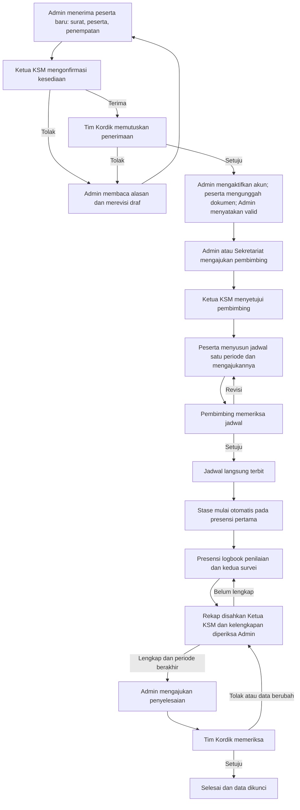

# Buku Panduan Penggunaan SIKORDIK

Sistem Informasi Manajemen Pendidikan Klinis RSBM

Edisi 2 | 8 Oktober 2026 | Mengikuti alur yang telah disederhanakan

Panduan ini membantu Admin Kordik, Tim Kordik, petugas KSM, pendidik, dan peserta menjalankan pendidikan klinis dari penerimaan hingga penyelesaian. Bila hanya butuh urutan singkat, baca [panduan ringkas](PANDUAN-RINGKAS.md).

Tiga hal yang selalu berlaku: buka Beranda dan kerjakan Tugas saya; satu peserta diurus dari satu halaman penempatan; menyetujui cukup satu klik, sedangkan menolak harus beralasan.

## Cara menggunakan buku ini

- Pengguna baru: baca halaman 2 sampai 5 untuk memahami titik mulai, istilah, tahap, dan tampilan aplikasi.
- Admin dan petugas KSM: gunakan halaman 6 sampai 11 untuk persiapan, penerimaan, dokumen, pembimbing, dan jadwal.
- Peserta dan pendidik: gunakan halaman 11 sampai 16 untuk jadwal, presensi, logbook, nilai, dan survei.
- Menutup stase atau mencari kendala: gunakan halaman 17 sampai 21.

Panduan ini dapat dipakai untuk orientasi dan latihan. Penggunaan operasional dengan data nyata mengikuti pemberitahuan kesiapan dan izin operasional dari pengelola RSBM. Gunakan alamat aplikasi dan akun yang diberikan pengelola.

## Daftar isi ringkas

- Halaman 2-5: titik mulai setiap peran, diagram proses bisnis, status, dan tampilan aplikasi.
- Halaman 6-8: persiapan pengelola, penerimaan peserta baru, peserta lama, dan impor.
- Halaman 9-11: keputusan penerimaan, dokumen, pembimbing, kelompok, dan jadwal.
- Halaman 12-14: presensi, rekap, logbook, dan penilaian.
- Halaman 15-16: keberatan nilai, perubahan stase, dan kedua survei.
- Halaman 17-18: kelengkapan akhir, penyelesaian, pembukaan kembali, dan arsip.
- Halaman 19-21: laporan, cek pengesahan, kendala, dan latihan lengkap.

Gunakan panel bookmark pada pembaca PDF untuk langsung menuju bab yang dibutuhkan.

<!-- page -->
# 1 Mulai dari peran Anda

Setelah masuk, buka Beranda. Bagian Tugas saya berisi pekerjaan yang menunggu Anda saat ini, dengan tombol untuk langsung mengerjakannya.

| Peran | Yang muncul di Tugas saya | Pekerjaan berikutnya |
|---|---|---|
| Super Admin | Tidak ada tugas stase | Siapkan data master, akun petugas, hak akses, dan cakupan KSM melalui Pengaturan |
| Admin Kordik | Ajukan ke KSM, periksa dokumen, aktifkan akun, ajukan pembimbing, cocokkan survei, ajukan penyelesaian | Terima peserta baru; pantau penempatan sampai selesai |
| Sekretariat KSM | Ajukan pembimbing, buat rekap presensi akhir | Bantu kelompok dan jadwal pada KSM-nya |
| Ketua atau Koordinator KSM | Konfirmasi kesediaan KSM, setujui penugasan dan perpanjangan, sahkan rekap | Pantau peserta pada KSM-nya |
| Tim Kordik | Putuskan penerimaan, pengecualian, perpanjangan, penyelesaian, dan pembukaan kembali | Pantau seluruh penempatan dan laporan |
| Peserta | Unggah dokumen, susun jadwal, isi presensi, unggah logbook, isi survei | Lihat nilai dan status penyelesaian di Stase saya |
| Pembimbing | Setujui jadwal, verifikasi presensi, periksa logbook, sahkan nilai, tanggapi keberatan | Catat kegiatan pembimbing dan isi penilaian |
| Penguji | Tidak ada antrean khusus | Isi penilaian pada penempatan yang ditugaskan; pembimbing mengesahkan dan memublikasikan |
| Supervisor | Periksa logbook pembimbing | Baca kegiatan pembimbing yang menunjuk Anda |

Satu akun dapat mempunyai beberapa role. Hak bertindak tetap mengikuti cakupan KSM, kepemilikan, dan penugasan resmi. Pemohon tidak boleh menyetujui sendiri permohonan yang mensyaratkan pemisahan petugas. Super Admin tidak otomatis menjadi pemberi keputusan bisnis.

Hasil orientasi: Anda tahu bahwa pekerjaan dimulai dari Beranda, data yang menjadi tanggung jawab Anda, dan petugas yang menerima pekerjaan berikutnya.

<!-- page -->
# 2 Peta proses bisnis dari awal sampai akhir

Proses berikut berlaku untuk satu penempatan. Peserta yang kembali mengikuti stase menggunakan data induk lama dan penempatan baru.

```mermaid
flowchart TD
    A[Admin menerima peserta baru: surat, peserta, penempatan] --> B[Ketua KSM mengonfirmasi kesediaan]
    B -->|Terima| C[Tim Kordik memutuskan penerimaan]
    B -->|Tolak| R[Admin membaca alasan dan merevisi draf]
    C -->|Tolak| R
    R --> A
    C -->|Setuju| D[Admin mengaktifkan akun; peserta mengunggah dokumen; Admin menyatakan valid]
    D --> E[Admin atau Sekretariat mengajukan pembimbing]
    E --> F[Ketua KSM menyetujui pembimbing]
    F --> G[Peserta menyusun jadwal satu periode dan mengajukannya]
    G --> H[Pembimbing memeriksa jadwal]
    H -->|Revisi| G
    H -->|Setuju| I[Jadwal langsung terbit]
    I --> J[Stase mulai otomatis pada presensi pertama]
    J --> K[Presensi logbook penilaian dan kedua survei]
    K --> L[Rekap disahkan Ketua KSM dan kelengkapan diperiksa Admin]
    L -->|Belum lengkap| K
    L -->|Lengkap dan periode berakhir| M[Admin mengajukan penyelesaian]
    M --> N[Tim Kordik memeriksa]
    N -->|Tolak atau data berubah| L
    N -->|Setuju| O[Selesai dan data dikunci]
```

Pada penerimaan, penolakan KSM atau Tim Kordik harus dibaca alasannya. Admin mengembalikan penempatan ke draf, memperbaiki, lalu mengajukan ulang. Pada kegiatan harian, permintaan revisi dikembalikan kepada penulis untuk diperbaiki dan diajukan ulang.

Penyelesaian hanya dapat diajukan setelah hari terakhir stase berakhir dan seluruh kewajiban lengkap. Berakhirnya tanggal stase tidak membuat status otomatis menjadi selesai.

<!-- page -->
# 3 Memahami data dan status

Peserta adalah data induk orang. Nomor peserta tetap dipakai saat orang yang sama datang kembali. Penempatan adalah satu episode pendidikan di KSM dengan institusi, program, jenis peserta, dan periode tertentu. Jadwal adalah kegiatan pada penempatan; satu penempatan mempunyai banyak jadwal.

Setiap halaman penempatan menampilkan garis lima tahap: Penerimaan, Dokumen, Jadwal, Stase, Selesai. Di bawahnya ada kalimat Langkah berikutnya yang menyebut siapa harus melakukan apa.

| Status yang tampil | Artinya | Penanggung jawab berikutnya |
|---|---|---|
| Draf | Data disiapkan; periode belum dipesan | Admin mengajukan ke KSM |
| Menunggu KSM | Menunggu kesediaan KSM | Ketua atau Koordinator KSM |
| Menunggu Tim Kordik | KSM menerima; menunggu keputusan penerimaan | Tim Kordik |
| Melengkapi dokumen | Penerimaan disetujui, dokumen belum lengkap | Peserta mengunggah, Admin Kordik memeriksa |
| Siap dijadwalkan | Dokumen lengkap | Admin atau Sekretariat mengajukan pembimbing; peserta menyusun jadwal |
| Terjadwal | Jadwal sudah terbit, stase belum berjalan | Peserta mengisi presensi pertama pada tanggal mulai |
| Sedang stase | Kegiatan dan administrasi harian berjalan | Peserta, pendidik, dan petugas |
| Menunggu penyelesaian | Penyelesaian sudah diajukan | Tim Kordik |
| Selesai | Penyelesaian disahkan dan data dikunci | Baca atau unduh sesuai hak akses |
| Ditolak KSM atau Ditolak Tim Kordik | Penerimaan ditolak dengan alasan | Admin meninjau dan merevisi bila akan diajukan ulang |
| Dibatalkan | Penempatan dibatalkan; riwayat tetap ada | Admin menindaklanjuti sesuai alasan |

Status penempatan berbeda dari status dokumen, jadwal, presensi, logbook, nilai, dan survei; masing-masing punya label sendiri di tabnya. Berkas yang diunggah juga berstatus: Menunggu pemeriksaan keamanan, Aman, Tertahan, atau Ditolak pemindai. Hanya berkas Aman yang dapat diunduh dan dinyatakan valid. Arsip adalah penanda penyimpanan riwayat, bukan penghapusan.

<!-- page -->
# 4 Masuk aplikasi dan mengenali tampilan

## Masuk dan keluar

1. Buka alamat SIKORDIK yang diberikan pengelola melalui peramban.
2. Masukkan Email dan Kata sandi, lalu tekan Masuk. Hindari Ingat saya pada perangkat bersama.
3. Peserta baru membuat kata sandi dari tautan sekali pakai yang diberikan Admin Kordik. Tautan berlaku 60 menit; isi email akun dan kata sandi baru minimal 12 karakter.
4. Jika lupa kata sandi, pilih Lupa kata sandi?, masukkan email akun, lalu ikuti tautan pemulihan yang diterima. Jika tidak diterima, hubungi pengelola akun.
5. Untuk mengganti kata sandi sendiri, buka Akun saya di kanan atas. Setelah diganti, perangkat lain yang masih masuk dikeluarkan.
6. Setelah selesai, gunakan Keluar. Jangan menyerahkan sesi yang masih aktif kepada pengguna lain.

Tidak ada pendaftaran mandiri peserta melalui halaman login.

## Menu

- Beranda: Tugas saya, penempatan Anda, jadwal hari ini, dan untuk petugas Ringkasan angka.
- Notifikasi: pemberitahuan keputusan dan pengajuan. Tombol Buka membawa ke penempatannya; menandai dibaca tidak menyetujui apa pun.
- Penempatan (peserta: Stase saya; pendidik: Peserta bimbingan): daftar penempatan dengan pencarian dan pilihan Sedang berjalan, Selesai, atau Ditolak / dibatalkan.
- Penerimaan peserta (Admin Kordik): Terima peserta baru, Daftar penerimaan, Data peserta, Surat masuk, Impor XLSX.
- Laporan Excel / PDF dan Cek pengesahan (QR).
- Pengaturan (petugas): pengguna, role, data master, lisensi pendidik, persyaratan dokumen, template penilaian, tautan survei, kelompok KSM, arsip, dan audit log.

## Halaman penempatan

Membuka satu penempatan menampilkan identitas peserta, garis tahap, Langkah berikutnya, lalu tab: Ringkasan, Dokumen, Pembimbing & jadwal, Presensi, Logbook, Nilai, dan Survei & penyelesaian. Tab hanya tampil bila Anda berwenang membukanya. Bagian Tindakan Anda hanya muncul bila ada yang dapat Anda lakukan pada tahap itu. Jam kegiatan menggunakan WITA.

<!-- page -->
# 5 Persiapan oleh pengelola dan Admin

Selesaikan persiapan sebelum memasukkan satu angkatan peserta. Semua ada di menu Pengaturan. Gunakan data resmi yang telah disetujui pengelola pendidikan.

## Urutan pengisian awal

1. Isi Institusi Pendidikan, Jenjang Pendidikan, KSM, dan Jenis Peserta. Pastikan kode tidak ganda dan status aktif.
2. Isi Program Studi dengan institusi serta jenjang yang sesuai. Isi Lokasi Klinis dan kaitkan dengan KSM yang benar; lokasi tanpa KSM tidak dapat dipakai untuk presensi.
3. Melalui Pengguna, tambahkan akun petugas dan pendidik. Isi identitas, email, jabatan, kata sandi minimal 12 karakter beserta konfirmasi, role, dan Scope KSM. Simpan pengguna.
4. Isi Pembimbing / Penguji / Supervisor. Tautkan akun yang benar, tentukan KSM dan kemampuan sebagai pembimbing, penguji, atau supervisor.
5. Melalui Lisensi pendidik, catat lisensi atau otorisasi pendidikan beserta masa berlakunya. Minimal satu lisensi aktif diperlukan dan harus berlaku sepanjang penugasan.
6. Siapkan Persyaratan dokumen (tambahan di luar bawaan), Template penilaian, dan Tautan survei untuk kedua jenis survei.

Persyaratan dokumen bawaan: Koas memerlukan surat pengantar, ijazah, dan BHD; Residen ditambah SIP, STR, dan sertifikat kompetensi; Nonkedokteran memerlukan surat pengantar dan ijazah.

## Mengelola perubahan

Gunakan Ubah untuk memperbaiki master atau akun, dan isi alasan ketika diminta. Saat menonaktifkan akun, sesi aktif pengguna dihapus. Periksa dampaknya terhadap pemeriksa yang masih mempunyai pekerjaan tertunda.

Role & hak akses mengatur permission sesuai kewenangan yang telah ditetapkan. Hindari memberi banyak role hanya agar tombol muncul; perbaiki cakupan dan penugasan yang menjadi dasar pekerjaan.

## Pemeriksaan sebelum angkatan dimulai

- Petugas KSM dapat melihat KSM yang menjadi tanggung jawabnya.
- Pendidik mempunyai akun, kemampuan peran, dan lisensi yang berlaku.
- Lokasi, persyaratan, template penilaian, dan kedua tautan survei sudah siap.
- Pengelola telah menyatakan lingkungan aplikasi siap digunakan. Panduan ini bukan persetujuan operasional.

<!-- page -->
# 6 Menerima peserta baru

Pelaksana adalah Admin Kordik. Siapkan surat pengantar dan daftar peserta. Satu surat dapat memuat satu atau banyak peserta; semuanya dimasukkan sekaligus.

1. Buka Penerimaan peserta, lalu Terima peserta baru.
2. Bagian 1, Surat pengantar: pilih surat yang sudah dicatat, atau biarkan Surat baru dan isi Institusi pengirim, Nomor surat, Tanggal surat, dan Perihal.
3. Bagian 2, Penempatan: pilih Program studi, Jenis peserta, KSM tujuan, tanggal Mulai dan Selesai. Isian ini berlaku untuk semua peserta di bawahnya. Program studi harus berasal dari institusi pengirim.
4. Bagian 3, Peserta: isi satu baris per orang. Nama wajib; NIM, tanggal lahir, dan email membantu mengenali peserta lama. Tekan Tambah 5 baris bila kurang, atau buka Atau tempel banyak peserta dari Excel dan tempel kolom Nama, NIM, Tanggal lahir, Email. Paling banyak 100 peserta sekali terima.
5. Tekan Lanjut: periksa data. Belum ada yang tersimpan pada tahap ini.
6. Pada Periksa sebelum menyimpan, setiap baris bertanda Peserta baru atau Mungkin peserta lama. Untuk yang kedua, pilih orang yang sama (data lama dipakai, penempatan baru dibuat) atau Orang berbeda dan tulis alasannya minimal 10 karakter. Sistem tidak pernah menggabungkan identitas secara otomatis.
7. Tekan Simpan & ajukan … penempatan ke KSM. Pilih Simpan sebagai draf bila belum akan diajukan.

Bila satu baris bermasalah, tidak ada yang tersimpan dan pesan menyebut nomor baris serta namanya. Perbaiki baris itu lalu kirim ulang.

Nomor surat yang sama pada institusi dan tahun yang sama tidak dapat dicatat dua kali; pilih surat tersebut dari daftar. Unggah PDF surat (maksimal 10 MB) dari tab Dokumen salah satu penempatan, pada baris Surat pengantar. Berkas surat berlaku untuk semua penempatan pada surat itu.

Benturan periode: tanggal awal dan akhir sama-sama termasuk periode, sehingga 1–10 September berbenturan dengan 10–20 September untuk peserta yang sama. Benturan dalam KSM yang sama diselesaikan melalui penempatan lama. Program paralel lintas KSM memerlukan pengecualian Tim Kordik (halaman 15).

Hasil: setiap peserta mempunyai penempatan berstatus Menunggu KSM. Contoh nomor peserta adalah PDK-2026-000001; nomor ini hanya ilustrasi.

<!-- page -->
# 7 Peserta lama, data peserta, dan impor

## Menambah penempatan untuk satu peserta lama

1. Buka Penerimaan peserta, lalu Data peserta. Cari nama, nomor peserta, atau NIM.
2. Pada baris peserta pilih Tambah penempatan. Pilih surat, program studi, jenis peserta, KSM, dan periode, lalu Simpan draft penempatan.
3. Pada halaman penempatan, baca peringatan benturan periode bila ada, lalu tekan Ajukan ke KSM.

Cara ini sama hasilnya dengan Terima peserta baru; gunakan untuk satu orang yang sudah terdaftar.

## Memperbaiki data induk

Pada Data peserta pilih Ubah data / foto. Perubahan wajib beralasan. Nomor peserta, akun, dan catatan penempatan lama tidak berubah. Foto: JPEG, PNG, atau WebP maksimal 3 MB. NIK bersifat opsional dan harus 16 digit; NIK yang sama tidak boleh dipakai dua orang.

Mendaftarkan satu peserta tanpa penempatan dilakukan dari Daftarkan peserta baru pada halaman yang sama: isi identitas, tekan Periksa kandidat duplikat, tinjau, lalu simpan.

## Impor data induk dari XLSX

Gunakan impor bila perlu memasukkan banyak data induk beserta NIK. Impor hanya membuat data peserta; penempatan tetap dibuat melalui Terima peserta baru atau Tambah penempatan.

1. Siapkan XLSX tanpa macro dengan satu worksheet, maksimal 5 MB dan 500 peserta. Format semua kolom sebagai teks agar nol di depan NIM dan NIK tidak hilang.
2. Baris pertama kolom A sampai E berurutan: name, birth_date, nik, nim, email. Tanggal memakai YYYY-MM-DD. Hindari formula dan tautan eksternal.
3. Buka Penerimaan peserta, lalu Impor XLSX. Pilih institusi dan berkas, lalu Unggah dan pratinjau.
4. Tinjau hasil setiap baris dan kandidat peserta lama. Pilih peserta lama secara eksplisit bila sama.
5. Konfirmasikan, lalu periksa hasil penyimpanan per baris. Jangan menganggap semua baris berhasil hanya karena unggahan selesai.

## Daftar penerimaan

Daftar penerimaan menampilkan semua penempatan dalam cakupan Anda dengan pencarian nama dan saringan status. Gunakan untuk memantau angkatan yang sedang diproses.

<!-- page -->
# 8 Keputusan penerimaan dan dokumen

## Keputusan KSM dan Tim Kordik

1. Ketua atau Koordinator KSM membuka Beranda. Pada Konfirmasi kesediaan KSM, tekan Putuskan sekaligus untuk satu rombongan, hilangkan centang peserta yang ingin diputuskan sendiri, lalu Setujui yang dicentang. Untuk satu peserta, tekan Putuskan lalu Terima peserta.
2. Untuk menolak, buka penempatannya, pilih Tolak…, tulis alasan minimal 10 karakter, lalu tekan tombol tolak.
3. Penempatan yang diterima KSM berstatus Menunggu Tim Kordik. Tim Kordik memutuskan dengan cara yang sama: Putuskan sekaligus atau Setujui penerimaan, dan Tolak penerimaan… dengan alasan.
4. Jika ditolak, Admin membaca alasannya di bagian atas tab Dokumen, lalu memilih Kembalikan ke draf untuk direvisi… bila akan mengajukan ulang.

## Akun peserta

Setelah penerimaan disetujui, tab Dokumen menampilkan Peserta belum punya akun kepada Admin. Periksa Email peserta, centang Email ini benar milik peserta, lalu Aktifkan akun. Sebuah tautan sekali pakai tampil di bagian atas halaman; kirimkan langsung kepada peserta. Peserta lama yang sudah punya akun tidak perlu diaktifkan lagi; ia langsung masuk dengan kata sandinya.

## Dokumen persyaratan

1. Peserta membuka Stase saya, tab Dokumen. Pada tiap persyaratan pilih Unggah berkas, pilih PDF, JPG, atau PNG maksimal 10 MB, centang Berkas tidak memuat identitas pasien, lalu Unggah. Admin Kordik dapat mengunggah atas nama peserta dengan cara yang sama.
2. Tunggu status berkas Aman. Unggah berhasil belum berarti dokumen dinyatakan valid.
3. Admin Kordik menekan Nyatakan valid pada tiap dokumen; isi Berlaku sampai bila dokumen punya masa berlaku. Masa berlaku harus mencakup akhir stase.
4. Bila berkas tidak sesuai, Admin memilih Minta perbaikan… dan menulis apa yang harus diperbaiki. Peserta mengunggah berkas pengganti.
5. Pengecualian persyaratan hanya diputuskan Tim Kordik melalui Kecualikan persyaratan ini… dengan alasan.
6. Setelah semua baris Valid atau Dikecualikan, Admin menekan Semua dokumen lengkap — lanjutkan. Status menjadi Siap dijadwalkan.

Surat pengantar dan berkas pendukung hanya diunggah Admin Kordik. Jangan mengunggah berkas yang memuat identitas atau data medis pasien.

<!-- page -->
# 9 Pembimbing dan kelompok

Pelaksana penyiapan adalah Admin Kordik atau Sekretariat KSM sesuai cakupan. Keputusan diberikan Ketua atau Koordinator KSM yang berbeda dari pemohon.

## Menetapkan pembimbing, penguji, dan supervisor

1. Buka penempatan, tab Pembimbing & jadwal.
2. Pada Ajukan pembimbing, pilih Pendidik dan perannya pada Sebagai: Pembimbing, Penguji, atau Supervisor. Tanggal Mulai dan Selesai sudah terisi sesuai periode stase; ubah bila penugasan lebih pendek.
3. Tekan Ajukan ke Ketua KSM.
4. Ketua KSM membuka Beranda, memilih Setujui penugasan pendidik, lalu menekan Setujui. Untuk menolak, pilih Tolak… dan tulis alasannya.

Hasil: penugasan berstatus Disetujui dan dapat dipilih pada jadwal, presensi, logbook, dan penilaian. Supervisor diperlukan bila pembimbing akan mencatat kegiatan pembimbing; penguji bila ada penilaian oleh penguji.

Bila pendidik tidak muncul dalam pilihan atau pengajuan ditolak sistem, periksa: KSM pendidik, kemampuan perannya, akun aktif dan tertaut, role akun, dan lisensi yang berlaku sepanjang penugasan.

## Mengganti pendidik

Buka Ajukan pendidik lain / pengganti, lalu Kelompok atau pergantian pendidik (opsional). Pilih pendidik baru, pilih penugasan lama pada Menggantikan, dan tulis alasan minimal 10 karakter. Setelah disetujui Ketua KSM, penugasan lama berstatus Digantikan dan riwayatnya tetap tersimpan.

Pergantian tidak memindahkan jadwal lama. Jadwal aktif yang masih merujuk pendidik lama harus diubah atau dibatalkan dahulu melalui Ubah / batalkan.

## Kelompok

Buat kelompok dari Pengaturan, Kelompok KSM. Pada tab Pembimbing & jadwal penempatan, buka Kelompok, pilih kelompok dan periode keanggotaan, isi alasan, lalu Masukkan ke kelompok. Perpindahan dilakukan dengan Akhiri keanggotaan lama disertai alasan, lalu memasukkan ke kelompok baru tanpa tumpang tindih.

Jadwal dan penugasan tetap dicatat per penempatan; menambah anggota tidak otomatis menyalin jadwal atau penugasan kelompok.

<!-- page -->
# 10 Menyusun jadwal

Peserta menyusun jadwal setelah pembimbing disetujui. Admin atau Sekretariat KSM dapat menyusunkan dengan menulis alasannya.

## Satu form untuk seluruh periode

1. Buka Stase saya, tab Pembimbing & jadwal, lalu Susun jadwal satu periode.
2. Isi Dari tanggal dan Sampai tanggal, centang Hari kegiatan, isi Kegiatan, pilih Lokasi dan Pembimbing. Jam mulai dan selesai bersifat opsional; tanpa jam berarti kegiatan sepanjang hari.
3. Tekan Simpan & ajukan ke pembimbing. Sistem membuat satu jadwal untuk setiap hari yang dipilih. Tanggal yang sudah punya jadwal dilewati, sehingga form aman diulang.
4. Pembimbing membuka Beranda, memilih Setujui jadwal peserta, lalu Setujui semua. Jadwal yang disetujui langsung terbit.
5. Bila ada hari yang perlu diubah, pembimbing memilih Minta revisi… pada jadwal itu dan menulis alasannya. Peserta memilih Ubah, memperbaiki, lalu Ajukan.

Untuk satu hari yang berbeda dari biasanya gunakan Tambah satu jadwal. Jadwal yang disimpan sebagai draf belum terlihat pembimbing; kirim dengan Ajukan atau Ajukan semua ke pembimbing.

## Stase mulai berjalan

Stase berstatus Sedang stase secara otomatis: saat jadwal terbit pada periode yang sudah berjalan, atau saat peserta mengisi presensi pertamanya. Admin Kordik juga dapat menekan Mulai stase sekarang. Syaratnya tetap: jadwal terbit, dokumen lengkap, dan tidak ada benturan periode.

## Aturan waktu dan perubahan

- Jam selesai harus lebih besar dari jam mulai. Jadwal 08.00–10.00 boleh diikuti 10.00–12.00.
- Jadwal yang berbenturan pada peserta yang sama ditolak, termasuk lintas KSM. Satu jadwal bermasalah membatalkan seluruh form; perbaiki rentang atau harinya lalu kirim ulang.
- Kegiatan lintas tengah malam dibuat sebagai dua kegiatan pada tanggal masing-masing.
- Jadwal terbit diubah melalui Ubah / batalkan: pilih jenis perubahan, isi alasan, ajukan, dan pembimbing menyetujuinya.
- Hari yang sudah memiliki presensi tidak dapat dibatalkan atau diganti.
- Draf atau pengajuan yang tidak jadi dipakai dihapus dari rencana melalui Hapus dari rencana… dengan alasan.

Pembimbing dapat menekan Tandai selesai setelah hari kegiatan berakhir. Ini bersifat opsional dan tidak menggantikan verifikasi presensi.

<!-- page -->
# 11 Presensi harian dan rekap

## Peserta mencatat kehadiran

1. Buka Stase saya, tab Presensi. Bagian Isi presensi menampilkan hari kegiatan yang belum diisi sampai hari ini.
2. Bila Anda mengikuti kegiatan sesuai jadwal, tekan Hadir pada hari itu. Lokasi, pembimbing, dan kegiatan diambil dari jadwal, dan presensi langsung dikirim ke pembimbing.
3. Untuk izin, sakit, terlambat, tidak hadir, atau kegiatan yang berbeda, buka Lainnya…, pilih Kehadiran, periksa Lokasi dan Pembimbing yang memverifikasi, tulis keterangan, lalu Kirim ke pembimbing.
4. Bila ditolak, baca catatan pembimbing pada baris tersebut, buka Perbaiki dan kirim ulang, lalu kirim kembali.

Satu tanggal mempunyai satu presensi per penempatan, meskipun ada beberapa sesi. Pengisian susulan diperbolehkan. Hari yang belum diisi tidak otomatis menjadi tidak hadir. Presensi hanya tersedia pada tanggal yang punya jadwal terbit. Sistem tidak memakai GPS atau foto.

## Pembimbing memverifikasi

Buka Beranda, pilih Verifikasi presensi. Bagian Menunggu verifikasi Anda mencantumkan semua hari; hilangkan centang hari yang belum akan diverifikasi, lalu tekan Verifikasi yang dicentang. Untuk menolak satu hari, buka Tolak hari ini… pada barisnya dan tulis alasan minimal 10 karakter.

Jika verifikator perlu diganti, Admin memakai Ganti verifikator… dengan penugasan resmi pengganti dan alasan.

## Rekap akhir dan koreksi

1. Setelah hari terakhir stase, Admin, Sekretariat KSM, atau Ketua KSM membuka tab Presensi dan menekan Buat rekap.
2. Bila masih ada hari belum diisi atau belum terverifikasi, lengkapi dahulu, lalu Buat ulang rekap dari data terbaru.
3. Ketua KSM membuka Lihat / cetak untuk memeriksa, lalu Sahkan & kunci. Hanya presensi terverifikasi yang dihitung.

Setelah rekap disahkan, koreksi hanya melalui Koreksi oleh Admin… dengan alasan. Koreksi memerlukan verifikasi ulang pembimbing, rekap baru, dan pengesahan ulang Ketua KSM. Jika penempatan sudah selesai, pembukaan kembali diperlukan lebih dahulu.

<!-- page -->
# 12 Logbook peserta dan pembimbing

## Peserta mengunggah logbook

1. Buka Stase saya, tab Logbook, lalu Unggah logbook peserta.
2. Isi Jenis logbook institusi dan pilih Pembimbing verifikator.
3. Pilih PDF logbook maksimal 10 MB, isi catatan bila perlu, dan centang pernyataan bebas identitas serta informasi medis pasien.
4. Tekan Simpan & ajukan. Bila berkas masih diperiksa keamanannya, logbook tersimpan sebagai draf; buka kembali dan tekan Ajukan ke pembimbing setelah berkas berstatus Aman.
5. Pantau hasilnya: Disetujui, Perlu revisi, atau Ditolak. Catatan pemeriksa ada pada bagian Pengajuan dan pemeriksaan.
6. Untuk revisi atau penolakan, tekan Unggah versi perbaikan, pilih PDF baru, lalu ajukan lagi. Gunakan logbook yang sama untuk jenis yang sama; versi lama tetap tersimpan.

## Pembimbing mencatat kegiatan pendidikan

1. Pada tab Logbook pilih Catat kegiatan pembimbing.
2. Pilih penugasan Anda, isi jenis kegiatan, tanggal, lokasi, jam mulai dan selesai pada hari yang sama, serta materi pembelajaran.
3. Pilih Supervisor pemeriksa. Lampiran PDF bersifat opsional, maksimal 10 MB.
4. Centang pernyataan privasi, lalu Simpan & ajukan. Durasi dihitung dari jam yang diisi.

## Memeriksa

Pembimbing memeriksa logbook peserta yang menunjuknya; supervisor memeriksa kegiatan pembimbing yang menunjuknya. Buka dari Beranda, baca isi dan unduh berkasnya, lalu tekan Setujui. Untuk Minta perbaikan atau Tolak, tulis catatan untuk penulis minimal 5 karakter.

Persetujuan disimpan sebagai pengesahan elektronik atas nama akun pemeriksa. Versi yang disetujui tidak dapat ditimpa. Rekap kegiatan hanya menghitung menit dari kegiatan pembimbing yang disetujui. Peserta tidak dapat membuka logbook pembimbing.

Jika pemeriksa yang sudah menerima pengajuan tidak lagi berwenang, hubungi Admin. Pengalihan logbook yang sudah diajukan belum tersedia sebagai tindakan langsung.

<!-- page -->
# 13 Penilaian dan publikasi hasil

## Admin menyiapkan template

Buka Pengaturan, Template penilaian. Isi nama, jenis penilaian, cakupan institusi, program, jenis peserta, atau KSM, dan periode bila diperlukan. Tambahkan komponen, jenis input, rentang skor, kewajiban pengisian, dan cara perhitungan sesuai formulir institusi.

Pada metode berbobot, total bobot harus 100 dan komponen angka wajib diisi. Nilai komponen dinormalisasi dari rentangnya ke skala total 0–100. Jika rumus institusi berbeda, gunakan tanpa perhitungan atau unggah formulir institusi yang sudah dihitung. Template yang tersimpan bersifat tetap; untuk perubahan, buat template pengganti dan nonaktifkan yang lama.

## Pembimbing atau penguji mengisi

1. Buka penempatan, tab Nilai, lalu Isi penilaian.
2. Pilih Tanggal penilaian dan template, lalu Terapkan tanggal dan template. Tanggal harus sudah berlangsung dan tercakup penempatan serta penugasan.
3. Isi Judul / identitas ujian. Pilih penugasan Anda sebagai pengisi dan Pembimbing pengesah.
4. Pilih metode: Formulir dinamis untuk mengisi komponen, atau Unggah formulir institusi untuk PDF yang sudah diisi dan ditandatangani, maksimal 10 MB.
5. Lengkapi catatan dan pernyataan privasi, lalu Simpan versi draft.
6. Pembimbing pengesah membuka nilai tersebut dan menekan Sahkan & publikasikan. Catatan bersifat opsional. Untuk formulir PDF, berkas harus sudah berstatus Aman.

Selama masih draf, isi dapat diperbaiki melalui Ubah isi nilai. Setelah dipublikasikan, peserta langsung dapat melihat nilai dan koreksi hanya melalui keberatan. Pengesahan dan publikasi tercatat sebagai dua kejadian atas nama pembimbing.

Penguji dapat mengisi berdasarkan penugasannya, tetapi hanya pembimbing pengesah yang dapat mengesahkan dan memublikasikan. Admin dan Tim Kordik memantau tanpa mengubah nilai.

## Peserta melihat nilai

Buka Stase saya, tab Nilai. Hanya nilai yang sudah dipublikasikan yang tampil. Versi koreksi yang belum dipublikasikan tidak menggantikan nilai yang terakhir dipublikasikan.

<!-- page -->
# 14 Keberatan nilai dan perubahan stase

## Keberatan nilai

1. Peserta membuka nilai yang dipublikasikan, lalu Ajukan keberatan atas nilai ini.
2. Tulis komponen yang dipermasalahkan dan alasannya, centang pernyataan privasi, lampirkan PDF bila perlu (maksimal 10 MB), lalu Ajukan keberatan. Satu keberatan tersedia untuk setiap versi publikasi.
3. Pembimbing pengesah membuka dari Beranda, menulis tanggapan minimal 5 karakter, lalu Terima keberatan atau Tolak keberatan. Lampiran harus sudah berstatus Aman.
4. Jika diterima, pembimbing menekan Buat versi koreksi, menyimpan, lalu Sahkan & publikasikan. Keberatan menjadi Koreksi selesai setelah versi koreksi dipublikasikan.

Nilai lama dan riwayatnya tidak dihapus. Penolakan keberatan tidak membuka pengeditan nilai.

## Mengubah periode atau KSM sebelum stase berjalan

Admin membuka tab Dokumen, Ubah periode atau KSM, mengisi tanggal, KSM, dan alasan. Perubahan mengembalikan penempatan ke draf dan persetujuan diulang dari awal.

## Program paralel lintas KSM

Bila penempatan draf berbenturan dengan penempatan di KSM lain, Admin mengunggah berkas pendukung pada Berkas pendukung lain, lalu membuka Minta pengecualian periode paralel lintas KSM. Tim Kordik menyetujui atau menolak. Persetujuan paralel tidak mengizinkan benturan jam kegiatan.

## Perpanjangan

1. Admin membuka tab Pembimbing & jadwal, Perpanjangan stase. Isi Tanggal akhir baru dan alasan, lalu Ajukan perpanjangan.
2. Ketua KSM lalu Tim Kordik menekan Setujui perpanjangan, atau Tolak… dengan alasan. Tanggal resmi berubah hanya setelah persetujuan Tim Kordik.
3. Sesudah disetujui, periksa masa berlaku dokumen, penugasan pendidik, dan keanggotaan kelompok; ketiganya tidak ikut diperpanjang otomatis.
4. Buat jadwal tambahan dengan penugasan yang mencakup tanggal tambahan.

## Pembatalan

Sebelum stase berjalan, Admin memilih Batalkan penempatan… dengan alasan. Setelah stase berjalan, pembatalan diputuskan Tim Kordik. Penempatan selesai memakai prosedur pembukaan kembali. Jangan menggandakan peserta untuk mengatasi perubahan periode.

<!-- page -->
# 15 Survei peserta dan wawancara pasien

Terdapat dua kewajiban per penempatan: survei kepuasan peserta dan satu respons survei wawancara pasien. Jawaban diisi di Google Form; SIKORDIK hanya menyimpan kode pencocokan dan statusnya.

## Admin menyiapkan tautan

1. Buka Pengaturan, Tautan survei.
2. Siapkan formulir untuk masing-masing jenis dengan satu kolom untuk kode respons. Untuk survei pasien, jangan meminta nama, NIK, nomor rekam medis, diagnosis, atau data medis sensitif; matikan pengumpulan email otomatis.
3. Catat nama, jenis, dan tautan respons Google Form: forms.gle atau docs.google.com/forms/d/e/…/viewform tanpa parameter.
4. Beri konfirmasi dan simpan. Untuk perubahan, buat tautan baru; kode yang sudah terbit tetap mengacu pada formulir asalnya.

## Peserta mengisi

Buka Stase saya, tab Survei & penyelesaian, bagian Dua survei wajib. Untuk tiap survei:

1. Centang pernyataan privasi, lalu tekan Ambil kode.
2. Salin kode yang tampil, tekan Buka Google Form, tempel kode pada kolomnya, isi, dan kirim.
3. Kembali ke SIKORDIK dan tekan Saya sudah mengirim formulir.

Status berubah menjadi Menunggu pemeriksaan Admin, lalu Terverifikasi. Survei tersedia selama stase berjalan atau menunggu penyelesaian.

## Admin mencocokkan

Buka dari Beranda, Cocokkan respons survei. Cari kode pada lembar respons Google Form, lalu tekan Ditemukan & lengkap atau Belum ditemukan. Jika belum ditemukan, peserta mengirim ulang formulir dengan kode yang sama dan menekan tombol kirim lagi.

Membuka tautan atau mengambil kode saja belum memenuhi kewajiban. Tim Kordik dapat melihat status tanpa membuka jawaban.

<!-- page -->
# 16 Checklist akhir dan penyelesaian

Buka penempatan, tab Survei & penyelesaian. Bagian Kelengkapan untuk menutup stase menampilkan setiap syarat dengan tanda Lengkap atau Belum. Pada baris Belum, tekan Buka untuk langsung menuju tempat memperbaikinya. Daftar yang sama tampil di tab Ringkasan.

## Syarat yang harus dituntaskan

- Seluruh tanggal stase berakhir; pengajuan paling awal pada hari setelah tanggal akhir resmi, termasuk perpanjangan yang disetujui.
- Dokumen wajib valid atau dikecualikan secara resmi, berkasnya Aman, dan masa berlakunya mencakup akhir stase.
- Rekap presensi terbaru disahkan Ketua KSM; seluruh hari kegiatan tercatat dan terverifikasi.
- Minimal satu logbook peserta tersedia. Semua logbook yang tercatat, termasuk kegiatan pembimbing, telah disetujui.
- Minimal satu penilaian tersedia. Semua penilaian yang tercatat telah dipublikasikan pada versi terkini; keberatan sudah ditolak atau koreksinya selesai.
- Kedua survei Terverifikasi.
- Tidak ada yang tertunda: penugasan, jadwal draf atau menunggu, perpanjangan, atau pengecualian periode.
- Admin memastikan kewajiban khusus institusi telah tercatat. Batas minimum aplikasi tidak menggantikan kewajiban institusi.

## Pengajuan dan keputusan

1. Setelah semua baris Lengkap, Admin Kordik menekan Ajukan penyelesaian ke Tim Kordik. Status menjadi Menunggu penyelesaian.
2. Tim Kordik yang berbeda dari pemohon membuka dari Beranda dan menekan Setujui penyelesaian, atau Tolak… dengan alasan minimal 10 karakter.
3. Jika data berubah setelah pengajuan, persetujuan ditolak sistem. Admin memilih Tarik permohonan untuk diperiksa ulang…, melengkapi, lalu mengajukan kembali.
4. Setelah disetujui, status menjadi Selesai dan nomor pengesahan tercatat pada Riwayat permohonan dan pengesahan.

Hasil: penempatan dikunci dan tanggal akhir aktual mengikuti tanggal akhir resmi. Penolakan atau penarikan mengembalikan status ke Sedang stase agar kekurangan ditindaklanjuti.

<!-- page -->
# 17 Sesudah selesai dan pembukaan kembali

## Membaca hasil akhir

Data yang diizinkan tetap dapat dibaca dan diunduh melalui tab penempatan. Presensi, logbook, nilai, keberatan, survei, dan dokumen dikunci setelah selesai. Simpan nomor pengesahan dan periksa versi terbaru saat menggunakan laporan.

## Memperbaiki penempatan selesai

1. Admin membuka tab Survei & penyelesaian pada penempatan selesai.
2. Pilih Ajukan pembukaan kembali…, jelaskan data yang perlu diperbaiki dan alasannya, lalu Ajukan ke Tim Kordik.
3. Tim Kordik menyetujui atau menolak. Persetujuan saja belum membuka penempatan.
4. Admin yang berbeda dari pemberi persetujuan menulis catatan pelaksanaan dan menekan Laksanakan pembukaan kembali. Sistem memeriksa ulang kondisi penempatan.
5. Status kembali ke Menunggu penyelesaian. Lakukan koreksi melalui aturan tiap tab, lalu ajukan penyelesaian baru.

Pembukaan kembali tidak otomatis mengizinkan perubahan versi logbook atau nilai yang sudah disahkan. Nilai mengikuti alur keberatan dan koreksi. Jika tindakan koreksi belum tersedia, minta tindak lanjut pengelola dan jangan membuat data pengganti yang menyamarkan riwayat.

## Arsip

Setelah retensi tiga tahun terpenuhi, penempatan selesai tanpa permohonan aktif menampilkan Arsipkan… kepada Admin; isi alasan lalu arsipkan. Penempatan arsip keluar dari daftar aktif dan tersedia melalui Pengaturan, Arsip, serta laporan yang berwenang.

Arsip tidak menghapus data, riwayat, atau berkas. Pemulihan arsip untuk koreksi belum tersedia sebagai tindakan langsung; hubungi pengelola bila diperlukan.

## Tanggung jawab pengguna

Gunakan akun sendiri, jangan membagikan kata sandi atau tautan sekali pakai, dan simpan hasil unduhan hanya pada penyimpanan yang disetujui pengelola. Jangan memasukkan identitas pasien ke catatan, alasan, logbook, lampiran, atau survei. Jika berkas salah terunggah, segera laporkan jenis berkas dan penempatannya kepada Admin tanpa menyebarkan isinya.

<!-- page -->
# 18 Laporan dan cek pengesahan

## Mengunduh laporan

1. Buka Laporan Excel / PDF, pilih Jenis laporan.
2. Atur institusi, KSM, peserta, penempatan, status, dan tanggal sesuai kebutuhan. Laporan nilai dan logbook wajib memilih satu penempatan.
3. Tekan Tampilkan dan periksa jumlah serta isi baris sebelum mengunduh.
4. Tekan Excel atau PDF. Jika batas ekspor terlampaui, persempit saringan: Excel maksimal 5.000 baris dan PDF maksimal 500 baris.
5. Simpan hasil sesuai ketentuan pengelola dan bagikan hanya kepada penerima yang berwenang.

Tersedia laporan penempatan dan riwayat, surat, dokumen, presensi, rekap sah, jadwal atau kegiatan pembimbing, logbook, nilai, survei, penyelesaian, dan metadata audit sesuai hak akses. Kartu pada Ringkasan angka di Beranda petugas membuka laporan atau daftar terkait.

Saringan tanggal penempatan mengambil periode yang beririsan; presensi dan jadwal memakai tanggal kegiatan. Surat memakai tanggal surat dan audit memakai waktu kejadian. Pilihan penempatan memuat maksimal 500 penempatan terbaru dalam cakupan. Laporan dokumen menunjukkan status pemeriksaan yang tercatat; laporan survei tidak menampilkan kode atau jawaban Google Form.

## Memeriksa pengesahan

1. Buka Cek pengesahan (QR), masukkan kode penempatan dari kolom Referensi pada laporan penempatan, tekan Cari, lalu pilih pengesahan. Alternatifnya, pindai QR pada pengesahan atau laporan.
2. Masuk dengan akun yang berwenang jika diminta. QR tidak membuka akses publik ke data.
3. Cocokkan jenis dokumen, nomor, versi, nama dan jabatan pengesah, serta waktu pengesahan. Perhatikan penanda riwayat jika dokumen sudah diganti atau penempatan dibuka kembali.
4. Jika hasil tidak sesuai atau akses ditolak, minta pemeriksaan Admin dengan menyertakan nomor pengesahan.

Pengesahan internal mencatat keputusan dalam SIKORDIK dan bukan tanda tangan elektronik tersertifikasi. QR memeriksa catatan pengesahan di sistem; QR tidak membuktikan bahwa PDF lain yang diterima di luar sistem sama dengan berkas sumber. Ekspor laporan bukan pengesahan baru.

<!-- page -->
# 19 Mengatasi kendala yang sering muncul

Langkah pertama untuk semua kendala: baca kalimat Langkah berikutnya pada halaman penempatan. Di sana tertulis siapa yang sedang ditunggu.

| Kendala | Pemeriksaan dan tindakan | Hubungi |
|---|---|---|
| Tidak bisa masuk | Periksa email dan kata sandi; tautan sekali pakai hanya berlaku 60 menit; gunakan Lupa kata sandi? | Pengelola akun |
| Tugas, tab, atau tombol tidak tampil | Hanya tampil pada orang yang berwenang di tahap itu; periksa peran, cakupan KSM, dan penugasan | Admin Kordik |
| Peserta tidak ditemukan atau ganda | Cari nama, nomor, atau NIM di Data peserta sebelum menambah data | Admin Kordik |
| Penempatan berbenturan | Periode awal dan akhir sama-sama dihitung; ubah periode atau minta pengecualian lintas KSM | Admin dan Tim Kordik |
| Pendidik tidak bisa dipilih | Periksa akun, KSM, lisensi, kemampuan peran, dan penugasan yang disetujui pada tanggal kegiatan | Admin dan KSM |
| Tombol Hadir tidak tampil | Belum ada jadwal terbit pada tanggal itu, atau tanggalnya belum tiba | Pembimbing |
| Berkas lama Menunggu pemeriksaan | Pemindai belum selesai atau belum tersedia; periksa format dan ukuran | Admin atau pengelola teknis |
| Nilai tidak terlihat peserta | Pembimbing belum menekan Sahkan & publikasikan | Pembimbing pengesah |
| Survei belum lengkap | Pastikan kode ditempel pada formulir, formulir terkirim, dan tombol kirim ditekan | Admin Kordik |
| Rekap tidak bisa disahkan | Lengkapi dan verifikasi seluruh hari kegiatan, lalu buat ulang rekap | Admin dan Ketua KSM |
| Penyelesaian tidak bisa diajukan | Tunggu hari setelah akhir stase dan tuntaskan semua baris Belum | Admin Kordik |
| Muncul pesan data berubah | Muat ulang halaman, baca status terbaru, lalu ulangi tindakan yang masih relevan | Petugas terkait |
| Data terkunci setelah selesai | Ajukan pembukaan kembali | Admin dan Tim Kordik |

Saat meminta bantuan, sertakan nama halaman, nomor peserta, waktu kejadian, status yang terlihat, dan teks pesan kesalahan. Jangan mengirim kata sandi, tautan sekali pakai, atau identitas pasien. Jika perlu tangkapan layar, tutup data sensitif yang tidak diperlukan.

<!-- page -->
# 20 Latihan alur lengkap dan ringkasan berkas

## Contoh latihan untuk orientasi

Gunakan peserta, institusi, dan KSM latihan yang disiapkan pengelola. Semua nama dan periode harus berupa data contoh yang jelas ditandai. Bergantilah akun sesuai peran pada tiap langkah.

1. Admin: Terima peserta baru dengan dua peserta, periksa, Simpan & ajukan. Hasil: Menunggu KSM.
2. Ketua KSM lalu Tim Kordik: Putuskan sekaligus dari Beranda. Hasil: Melengkapi dokumen.
3. Admin: Aktifkan akun dan serahkan tautan. Peserta: buat kata sandi, unggah dokumen. Admin: Nyatakan valid, lalu Semua dokumen lengkap — lanjutkan. Hasil: Siap dijadwalkan.
4. Admin: Ajukan pembimbing. Ketua KSM: Setujui. Peserta: Susun jadwal satu periode, Simpan & ajukan. Pembimbing: Setujui semua. Hasil: Terjadwal.
5. Peserta: Hadir pada hari berjalan. Pembimbing: Verifikasi yang dicentang. Hasil: Sedang stase.
6. Peserta: unggah logbook, Simpan & ajukan. Pembimbing: Setujui, lalu isi penilaian dan Sahkan & publikasikan. Hasil: peserta dapat membaca nilainya.
7. Peserta: kedua survei sampai Saya sudah mengirim formulir. Admin: Ditemukan & lengkap.
8. Setelah periode berakhir: Sekretariat Buat rekap, Ketua KSM Sahkan & kunci, Admin Ajukan penyelesaian, Tim Kordik Setujui penyelesaian. Hasil: Selesai dan terkunci.

Lakukan satu putaran penolakan, misalnya pembimbing meminta revisi jadwal atau menolak satu presensi, agar pengguna memahami bahwa perbaikan harus dikirim ulang. Catat petugas yang masih perlu latihan sebelum bekerja mandiri.

## Batas unggahan yang digunakan

| Berkas | Format | Maksimal |
|---|---|---|
| Foto peserta | JPEG, PNG, WebP | 3 MB |
| Surat pengantar | PDF | 10 MB |
| Dokumen persyaratan | PDF, JPEG, PNG | 10 MB |
| Logbook peserta dan lampiran pembimbing | PDF | 10 MB |
| Penilaian institusi dan lampiran keberatan | PDF | 10 MB |
| Impor data peserta | XLSX tanpa macro, satu worksheet | 5 MB dan 500 peserta |

Ingat urutan kerja: buka Beranda, kerjakan Tugas saya, baca Langkah berikutnya. Menyetujui cukup satu klik; menolak selalu disertai alasan.
