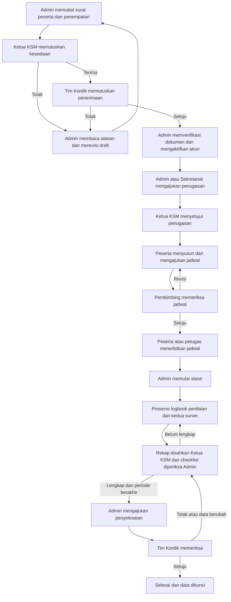

# Proses Bisnis SIKORDIK

Proses berikut berlaku untuk satu penempatan. Peserta yang kembali mengikuti stase menggunakan data induk lama dan penempatan baru.

Pada penerimaan, penolakan KSM atau Tim Kordik harus dibaca alasannya. Admin memperbaiki melalui revisi kembali ke draft dan mengulangi pengajuan. Pada kegiatan harian, permintaan revisi dikembalikan kepada penulis untuk diperbaiki dan diajukan ulang.

Penyelesaian hanya dapat diajukan setelah hari terakhir stase berakhir dan seluruh kewajiban lengkap. Berakhirnya tanggal stase tidak membuat status otomatis menjadi selesai.

<!-- page -->

# Pembagian Tugas dan Titik Mulai

Jangan mulai dari urutan menu di layar. Mulailah dari tanggung jawab Anda dan status penempatan peserta.

| Peran | Langkah pertama | Pekerjaan berikutnya |
|---|---|---|
| Super Admin | Siapkan master KSM dan akun petugas | Atur hak akses dan cakupan KSM; pantau sistem |
| Admin Kordik | Cari peserta lama dan catat surat masuk | Buat penempatan, ajukan, periksa dokumen, siapkan penugasan, pantau dan ajukan penyelesaian |
| Sekretariat KSM | Periksa penempatan KSM Anda | Bantu penugasan, kelompok, jadwal, dan pembuatan rekap |
| Ketua atau Koordinator KSM | Periksa antrean penerimaan KSM | Putuskan penugasan dan perpanjangan; sahkan rekap presensi |
| Tim Kordik | Periksa penerimaan yang telah diterima KSM | Putuskan penerimaan, pengecualian, perpanjangan dan penyelesaian |
| Peserta | Pastikan akun aktif dan penempatan benar | Susun jadwal setelah penugasan siap; isi presensi, logbook dan survei; lihat nilai |
| Pembimbing | Pastikan penugasan resmi sudah disetujui | Periksa jadwal, presensi dan logbook peserta; isi, sahkan dan publikasikan nilai |
| Penguji | Periksa penugasan sebagai penguji | Isi penilaian; pembimbing yang ditunjuk mengesahkan dan memublikasikan |
| Supervisor | Periksa penugasan sebagai supervisor | Periksa logbook kegiatan pembimbing yang menunjuk Anda |

Satu akun dapat mempunyai beberapa role. Hak bertindak tetap mengikuti cakupan KSM, kepemilikan, dan penugasan resmi. Pemohon tidak boleh menyetujui sendiri permohonan yang mensyaratkan pemisahan petugas. Super Admin tidak otomatis menjadi pemberi keputusan bisnis.

Hasil orientasi: Anda mengetahui menu pertama yang dibuka, data yang menjadi tanggung jawab Anda, dan petugas yang menerima pekerjaan berikutnya.

<!-- page -->

# Pemeriksaan Akhir dan Penyelesaian

Mulai pemeriksaan melalui Survei & penyelesaian, pilih penempatan lalu lihat Kelengkapan saat ini. Tautan Dokumen, Presensi, Logbook dan Penilaian membantu membuka pekerjaan yang belum lengkap.

## Syarat yang harus dituntaskan

- Seluruh tanggal stase berakhir; pengajuan paling awal pada hari setelah tanggal akhir resmi, termasuk perpanjangan yang disetujui.
- Dokumen wajib valid atau memiliki pengecualian resmi, berkas lolos pemeriksaan, dan masa berlaku mencakup akhir stase.
- Rekap presensi terbaru telah disahkan Ketua KSM; seluruh hari pendidikan tercatat dan terverifikasi.
- Minimal satu logbook peserta tersedia. Semua logbook yang tercatat, termasuk logbook pembimbing, telah disetujui.
- Minimal satu penilaian tersedia. Semua penilaian tercatat telah dipublikasikan pada versi terkini; keberatan sudah Ditolak atau Selesai.
- Kedua survei telah Terverifikasi.
- Tidak ada proses tertunda, termasuk penugasan, jadwal draft/revisi/pengajuan/disetujui belum terbit, perpanjangan atau pengecualian periode.
- Admin telah memastikan seluruh kewajiban khusus institusi tercatat. Batas minimum aplikasi tidak menggantikan kewajiban institusi.

## Pengajuan dan keputusan

1. Admin memperbaiki seluruh indikator Belum hingga lengkap.
2. Pada Pemeriksaan dan keputusan pilih Ajukan penyelesaian. Isi Alasan dan hasil pemeriksaan minimal 10 karakter, centang konfirmasi lalu Simpan tindakan.
3. Status menjadi menunggu_penyelesaian. Tim Kordik yang berbeda dari pemohon memeriksa permohonan dan memilih Setujui permohonan atau Tolak permohonan, disertai alasan dan konfirmasi.
4. Jika data berubah setelah pengajuan, lakukan penarikan atau penolakan dan pemeriksaan ulang. Admin mengajukan kembali berdasarkan data terbaru.
5. Setelah disetujui, pastikan status selesai dan nomor pengesahan tercatat dalam Riwayat permohonan dan pengesahan.

Hasil: penempatan dikunci dan tanggal akhir aktual mengikuti tanggal akhir resmi. Penolakan atau penarikan penyelesaian mengembalikan status sedang_stase agar kekurangan ditindaklanjuti.

