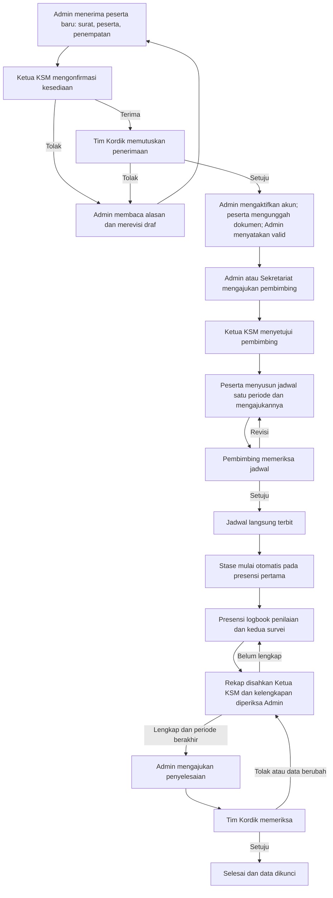

# Proses Bisnis SIKORDIK

Proses berikut berlaku untuk satu penempatan. Peserta yang kembali mengikuti stase menggunakan data induk lama dan penempatan baru.

```mermaid
flowchart TD
    A[Admin menerima peserta baru: surat, peserta, penempatan] --> B[Ketua KSM mengonfirmasi kesediaan]
    B -->|Terima| C[Tim Kordik memutuskan penerimaan]
    B -->|Tolak| R[Admin membaca alasan dan merevisi draf]
    C -->|Tolak| R
    R --> A
    C -->|Setuju| D[Admin mengaktifkan akun; peserta mengunggah dokumen; Admin menyatakan valid]
    D --> E[Admin atau Sekretariat mengajukan pembimbing]
    E --> F[Ketua KSM menyetujui pembimbing]
    F --> G[Peserta menyusun jadwal satu periode dan mengajukannya]
    G --> H[Pembimbing memeriksa jadwal]
    H -->|Revisi| G
    H -->|Setuju| I[Jadwal langsung terbit]
    I --> J[Stase mulai otomatis pada presensi pertama]
    J --> K[Presensi logbook penilaian dan kedua survei]
    K --> L[Rekap disahkan Ketua KSM dan kelengkapan diperiksa Admin]
    L -->|Belum lengkap| K
    L -->|Lengkap dan periode berakhir| M[Admin mengajukan penyelesaian]
    M --> N[Tim Kordik memeriksa]
    N -->|Tolak atau data berubah| L
    N -->|Setuju| O[Selesai dan data dikunci]
```

Pada penerimaan, penolakan KSM atau Tim Kordik harus dibaca alasannya. Admin mengembalikan penempatan ke draf, memperbaiki, lalu mengajukan ulang. Pada kegiatan harian, permintaan revisi dikembalikan kepada penulis untuk diperbaiki dan diajukan ulang.

Penyelesaian hanya dapat diajukan setelah hari terakhir stase berakhir dan seluruh kewajiban lengkap. Berakhirnya tanggal stase tidak membuat status otomatis menjadi selesai.

<!-- page -->

# Pembagian Tugas dan Titik Mulai

Setelah masuk, buka Beranda. Bagian Tugas saya berisi pekerjaan yang menunggu Anda saat ini, dengan tombol untuk langsung mengerjakannya.

| Peran | Yang muncul di Tugas saya | Pekerjaan berikutnya |
|---|---|---|
| Super Admin | Tidak ada tugas stase | Siapkan data master, akun petugas, hak akses, dan cakupan KSM melalui Pengaturan |
| Admin Kordik | Ajukan ke KSM, periksa dokumen, aktifkan akun, ajukan pembimbing, cocokkan survei, ajukan penyelesaian | Terima peserta baru; pantau penempatan sampai selesai |
| Sekretariat KSM | Ajukan pembimbing, buat rekap presensi akhir | Bantu kelompok dan jadwal pada KSM-nya |
| Ketua atau Koordinator KSM | Konfirmasi kesediaan KSM, setujui penugasan dan perpanjangan, sahkan rekap | Pantau peserta pada KSM-nya |
| Tim Kordik | Putuskan penerimaan, pengecualian, perpanjangan, penyelesaian, dan pembukaan kembali | Pantau seluruh penempatan dan laporan |
| Peserta | Unggah dokumen, susun jadwal, isi presensi, unggah logbook, isi survei | Lihat nilai dan status penyelesaian di Stase saya |
| Pembimbing | Setujui jadwal, verifikasi presensi, periksa logbook, sahkan nilai, tanggapi keberatan | Catat kegiatan pembimbing dan isi penilaian |
| Penguji | Tidak ada antrean khusus | Isi penilaian pada penempatan yang ditugaskan; pembimbing mengesahkan dan memublikasikan |
| Supervisor | Periksa logbook pembimbing | Baca kegiatan pembimbing yang menunjuk Anda |

Satu akun dapat mempunyai beberapa role. Hak bertindak tetap mengikuti cakupan KSM, kepemilikan, dan penugasan resmi. Pemohon tidak boleh menyetujui sendiri permohonan yang mensyaratkan pemisahan petugas. Super Admin tidak otomatis menjadi pemberi keputusan bisnis.

Hasil orientasi: Anda tahu bahwa pekerjaan dimulai dari Beranda, data yang menjadi tanggung jawab Anda, dan petugas yang menerima pekerjaan berikutnya.

<!-- page -->

# Pemeriksaan Akhir dan Penyelesaian

Buka penempatan, tab Survei & penyelesaian. Bagian Kelengkapan untuk menutup stase menampilkan setiap syarat dengan tanda Lengkap atau Belum. Pada baris Belum, tekan Buka untuk langsung menuju tempat memperbaikinya. Daftar yang sama tampil di tab Ringkasan.

## Syarat yang harus dituntaskan

- Seluruh tanggal stase berakhir; pengajuan paling awal pada hari setelah tanggal akhir resmi, termasuk perpanjangan yang disetujui.
- Dokumen wajib valid atau dikecualikan secara resmi, berkasnya Aman, dan masa berlakunya mencakup akhir stase.
- Rekap presensi terbaru disahkan Ketua KSM; seluruh hari kegiatan tercatat dan terverifikasi.
- Minimal satu logbook peserta tersedia. Semua logbook yang tercatat, termasuk kegiatan pembimbing, telah disetujui.
- Minimal satu penilaian tersedia. Semua penilaian yang tercatat telah dipublikasikan pada versi terkini; keberatan sudah ditolak atau koreksinya selesai.
- Kedua survei Terverifikasi.
- Tidak ada yang tertunda: penugasan, jadwal draf atau menunggu, perpanjangan, atau pengecualian periode.
- Admin memastikan kewajiban khusus institusi telah tercatat. Batas minimum aplikasi tidak menggantikan kewajiban institusi.

## Pengajuan dan keputusan

1. Setelah semua baris Lengkap, Admin Kordik menekan Ajukan penyelesaian ke Tim Kordik. Status menjadi Menunggu penyelesaian.
2. Tim Kordik yang berbeda dari pemohon membuka dari Beranda dan menekan Setujui penyelesaian, atau Tolak… dengan alasan minimal 10 karakter.
3. Jika data berubah setelah pengajuan, persetujuan ditolak sistem. Admin memilih Tarik permohonan untuk diperiksa ulang…, melengkapi, lalu mengajukan kembali.
4. Setelah disetujui, status menjadi Selesai dan nomor pengesahan tercatat pada Riwayat permohonan dan pengesahan.

Hasil: penempatan dikunci dan tanggal akhir aktual mengikuti tanggal akhir resmi. Penolakan atau penarikan mengembalikan status ke Sedang stase agar kekurangan ditindaklanjuti.
